# 0 intro

fuck you ans kiss my ass.

# 9 Programmable interrupt controller (PIC)

## Motivation

Connect (more then 1)    devices to processor's interrupt input.

> Why not use a OR gate?
>
> no way to tell which device
{: .prompt-tip }

## Overview

{: .w-75}

- `A` = address match for ports
- `CS’` = chip select (does processor want PIC to read/write?)
- `RD’` and `WR’` defined from processor’s point of view
  - `RD’` = processor will read data (vector #) from PIC
  - `WR’` = processor will write data (command, EOI) to PIC

Ports: `0x20` & `0x21`

- `0x20`: command port
- `0x21`: data port

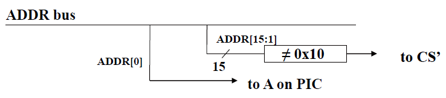{: .w-50}

i.e. `CS'` only enabled when `ADDR` is `0x20` or `0x21`.

prioritization on 8259A: 0 is high, 7 is low

## Steps

When a device **raises an interrupt**...

- check if priority is higher than those of in service interrupts
- if not, do nothing
- if so
  - report the highest priority raised to the processor
  - mark that device as being in service

When processor reports `EOI` (end of interrupt) for
some interrupt...

- remove the interrupt from the in service mask
- check for raised interrupt lines that should be reported to processor

How to report a interrupt?

- PIC raises `INTR`
- processor strobes `INTA’` (active low) repeatedly
  - creates cycles for PIC to write **vector** to data bus
  - (must follow spec timing! PIC is not infinitely fast.)
- processor sends `EOI` with specific combinations of A & D inputs (A is from address bus, D is from data bus)

## Cascading

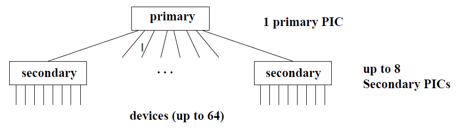{: .w-50}

Up to 8x8=64 devices with cascading.

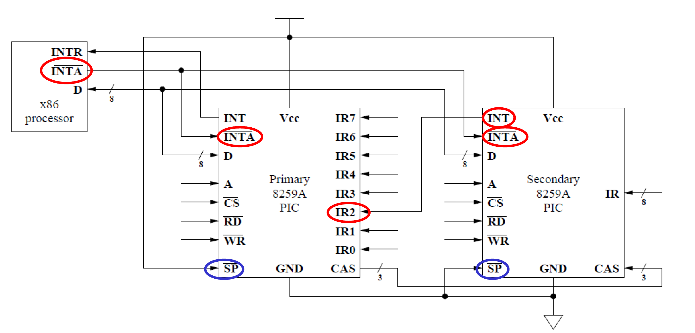{: .w-50}

### Architecture

secondary 8259A: ports `0xA0` & `0xA1`

secondary PIC & primary PIC:

- share `D` and `INTA'`
- secondary PIC connects to `IR2` on primary PIC.
- `SP'`: low -> secondary PIC; 1 -> primary PIC.
- `CAS` 3bit, indicate which secondary PIC (8 PIC's max) to respond on data bus.

<!-- <details markdown="1">
  <summary>Linux 8259A Initialization Code</summary> -->

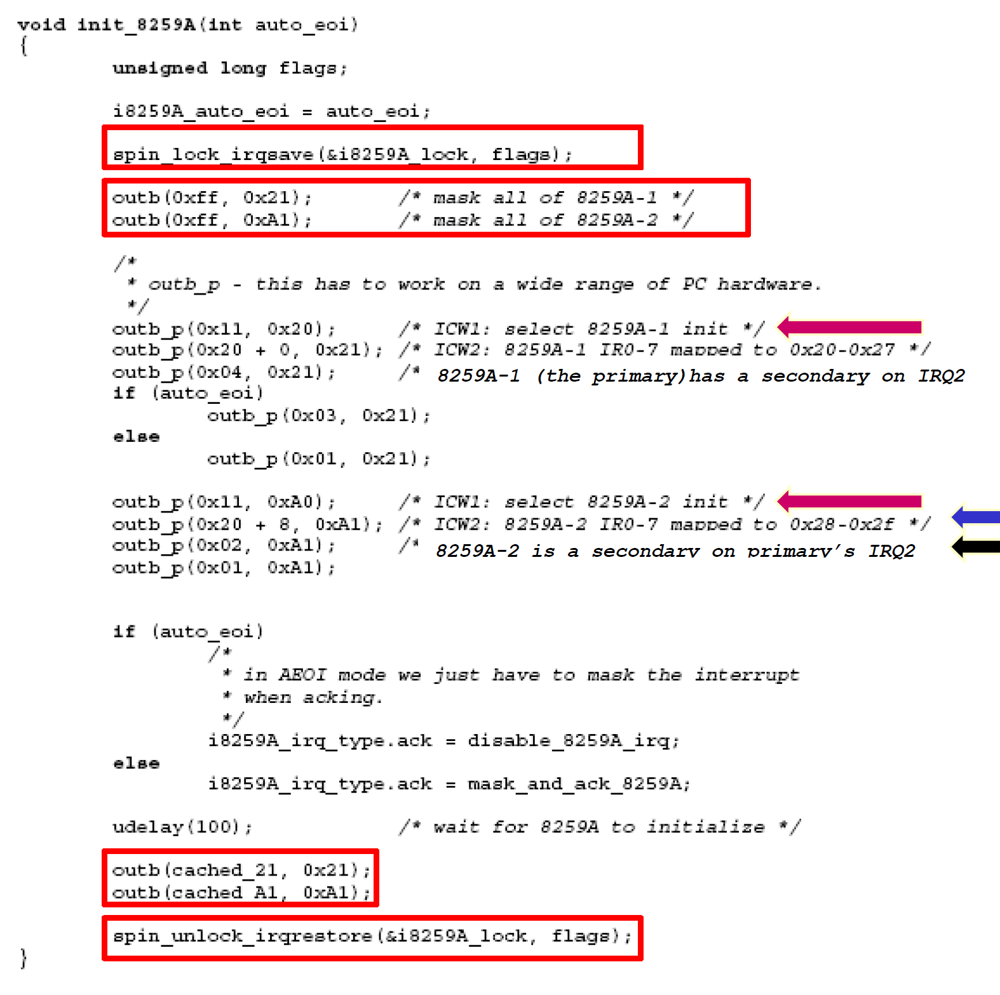{:. w-50}

1. What is the auto_eoi parameter? always = 0
2. Four initialization control words to set up primary 8259A
3. Four initialization control words to set up secondary 8259A

|ICW|port(A=?)|info contained in Initialization Control Word|
|---|---|---|
|ICW1|0|start init, edge triggered inputs, cascade mode, 4 ICWs |
|ICW2|1|high bits of vector # |
|ICW3|1|primary PIC: bit vector of secondary PIC<br>secondary PIC: input pin on primary PIC |
|ICW4|1|ISA=x86, normal/auto EOI |

> Other details
>
> 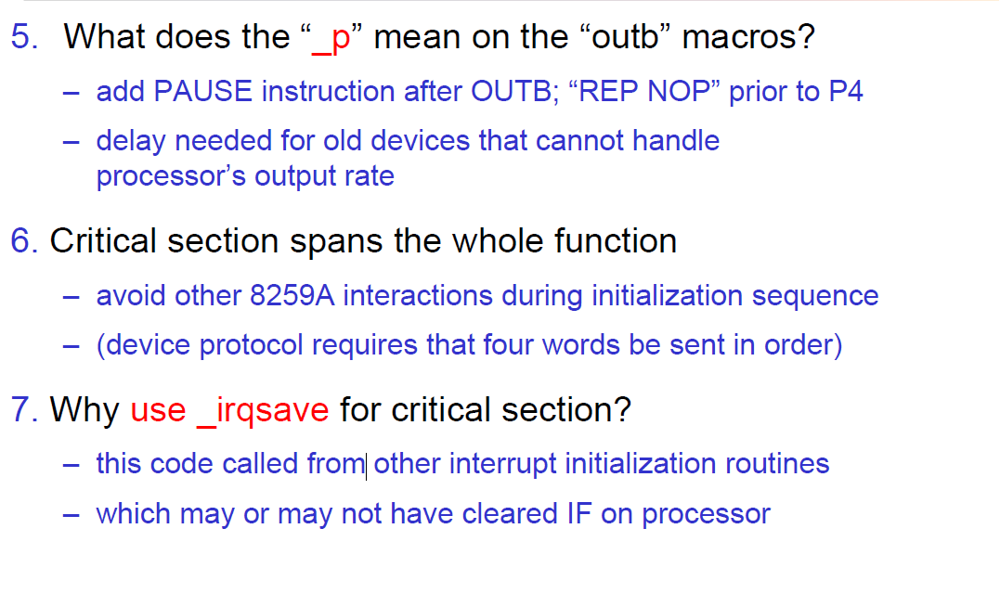{: .w-50}

<!-- </details> -->

# 10 Linux abstraction of PIC

Linux use a **jump table** (NOT IDT) `hw_irq_controller` for each vector number.

The table is used to interact with appropriate PIC.

|`hw_irq_controller`| function | Comment |
|:---|:---|:---|
|human readable name | `const char* name;` | e.g. “XTPIC” PIC”; see `/proc/interrupts`{: .filepath} |
|startup function | `unsigned int (*startup)(unsigned int irq);` | called when first handler is `installed` for an interrupt; change the corresponding `mask bit` in 8259A |
|shutdown function | `void (*shutdown)(unsigned int irq);` | called after last handler is `removed` for an interrupt; change the corresponding `mask bit` in 8259A |
|enable function | `void (*enable)...` |  |
|disable function | `void (*disable)...` |  |
|mask function|  |  |
|mask_ack function|  |  |
|unmask function |  |  |
|(+ several others…) |  |  |

Also

- `void (*ack) ...`, called at start of interrupt handling to ack receipt of the interrupt (sends EOI to PIC).
- `void (*end)...`, called at end of interrupt handling (on 8259, enables interrupt (unmasks it) on PIC).

*Initially, all 8259A interrupts are masked out using mask on 8259A (then use startup / shutdown function...).

# General interrupt abstractions

## Interrupt Chaining

### Motivation

Problems:

- may have > 15 devices.
- 1 deivce may be reponded by >1 hendler.

### ~~One approach~~

Form a linked list for handlers.

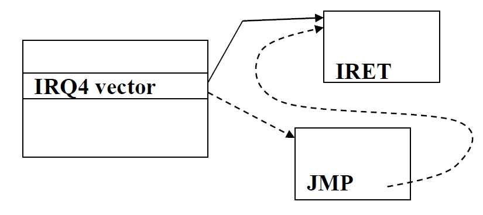{: .w-50}

bad:

- no way to remove self unless you’re first in list

### Solution

interrupt chaining with linked list data structure.

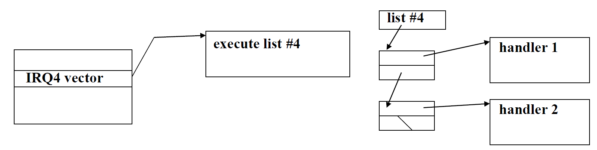{: .w-50}

### Drawbacks of chaining

- for > 1 device: must query devices to see if they raised interrupt
- for 1 device: must avoid stealing data/confusing device

## Soft Interrupts

**software** generated (soft) interrupt. runs at priority **between program and hard interrupts**, **has no access to INTR pin!**

Usually generated by hard interrupt handlers to do work not involving device

> hardware interrupt (1st stage) need to be fast
>
> tasklet (2nd stage) can be triggered by hardware interrupt handlers and do tasks that not involving the device.

Linux version is called **tasklets**.

example: network encryption/decryption, decrypter want to interrupt program.

See [Soft Interrupts in Linux](#13-soft-interrupts-in-linux)

## `irq_desc` / `irqaction` Structures

<details markdown="1">
   <summary>Code</summary>

**`irq_desc`**

```c
/**
 * struct irq_desc - interrupt descriptor
 * @irq_data:  per irq and chip data passed down to chip functions
 * @timer_rand_state: pointer to timer rand state struct
 * @kstat_irqs:  irq stats per cpu
 * @handle_irq:  highlevel irq-events handler [if NULL, __do_IRQ()]
 * @action:  the irq action chain
 * @status:  status information
 * @core_internal_state__do_not_mess_with_it: core internal status information
 * @depth:  disable-depth, for nested irq_disable() calls
 * @wake_depth:  enable depth, for multiple set_irq_wake() callers
 * @irq_count:  stats field to detect stalled irqs
 * @last_unhandled: aging timer for unhandled count
 * @irqs_unhandled: stats field for spurious unhandled interrupts
 * @lock:  locking for SMP
 * @affinity_notify: context for notification of affinity changes
 * @pending_mask: pending rebalanced interrupts
 * @threads_oneshot: bitfield to handle shared oneshot threads
 * @threads_active: number of irqaction threads currently running
 * @wait_for_threads: wait queue for sync_irq to wait for threaded handlers
 * @dir:  /proc/irq/ procfs entry
 * @name:  flow handler name for /proc/interrupts output
 */
struct irq_desc {
 struct irq_data  irq_data;
 struct timer_rand_state *timer_rand_state;
 unsigned int __percpu *kstat_irqs;
 irq_flow_handler_t handle_irq;
#ifdef CONFIG_IRQ_PREFLOW_FASTEOI
 irq_preflow_handler_t preflow_handler;
#endif
 struct irqaction *action; /* IRQ action list */
 unsigned int  status_use_accessors;
 unsigned int  core_internal_state__do_not_mess_with_it;
 unsigned int  depth;  /* nested irq disables */
 unsigned int  wake_depth; /* nested wake enables */
 unsigned int  irq_count; /* For detecting broken IRQs */
 unsigned long  last_unhandled; /* Aging timer for unhandled count */
 unsigned int  irqs_unhandled;
 raw_spinlock_t  lock;
#ifdef CONFIG_SMP
 const struct cpumask *affinity_hint;
 struct irq_affinity_notify *affinity_notify;
#ifdef CONFIG_GENERIC_PENDING_IRQ
 cpumask_var_t  pending_mask;
#endif
#endif
 unsigned long  threads_oneshot;
 atomic_t  threads_active;
 wait_queue_head_t       wait_for_threads;
#ifdef CONFIG_PROC_FS
 struct proc_dir_entry *dir;
#endif
 const char  *name;
} ____cacheline_internodealigned_in_smp;
```

**`irqaction`**

```c
/**
 * struct irqaction - per interrupt action descriptor
 * @handler: interrupt handler function
 * @flags: flags (see IRQF_* above)
 * @name: name of the device
 * @dev_id: cookie to identify the device
 * @next: pointer to the next irqaction for shared interrupts
 * @irq: interrupt number
 * @dir: pointer to the proc/irq/NN/name entry
 * @thread_fn: interrupt handler function for threaded interrupts
 * @thread: thread pointer for threaded interrupts
 * @thread_flags: flags related to @thread
 * @thread_mask: bitmask for keeping track of @thread activity
 */
struct irqaction {
 irq_handler_t handler;
 unsigned long flags;
 void *dev_id;
 struct irqaction *next;
 int irq;
 irq_handler_t thread_fn;
 struct task_struct *thread;
 unsigned long thread_flags;
 unsigned long thread_mask;
 const char *name;
 struct proc_dir_entry *dir;
} ____cacheline_internodealigned_in_smp;
```

</details>

## `request_irq` function

<details markdown="1">
<summary>Code</summary>

```c
extern int __must_check
request_irq(unsigned int irq, irq_handler_t handler, unsigned long flags,
     const char *name, void *dev);
```

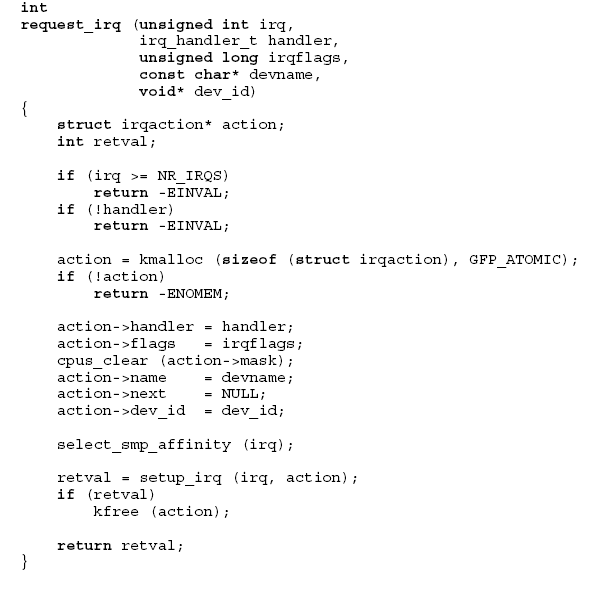

</details>

<details markdown="1">
<summary>Comments</summary>

- `irq` - irq # (0-15 for PIC)
  - `handler` - pointer to interrupt handler with following arguments
    - irq #
    - dev_id pointer (type void*)
    - handlers should return 1 if handled, 0 if not
- `irqflags` - bit vector
  - `IRQF_SHARED` - interrupt chaining is allowed
  - `IRQF_DISABLED` - execute handlers with IF=0
  - `IRQF_SAMPLE_RANDOM` - use device timing as source of random numbers
- `devname` - human-readable device name (visible in /proc/interrupts)
- `dev_id` - pointer to device-specific data (returned to handler when called)

---

- Start by checking values
  (two checks from the shown code)
- Dynamically allocate new action structure for linked list of actions
- Fill in the new action structure
- Try to add it
  - using `setup_irq`
  - if call fails, free the action structure

</details>

<details markdown="1">
<summary>Comments GPT</summary>

In Linux, `request_irq` is a kernel function that is called when a driver **wants to register an interrupt handler with the kernel.** It is typically called during the initialization phase of a device driver, after the device has been set up and is ready to handle int errupts.

Here is what `request_irq` does:

1. **Registration**: It registers a new interrupt handler for the specified interrupt line with the kernel. The interrupt line is usually associated with a hardware device that generates interrupts.

2. **Handler Function**: The function expects the interrupt number, a pointer to the interrupt handler function that should be called when the interrupt occurs, interrupt flags that control the behavior of the interrupt, a name for the interrupt (for identification in `/proc/interrupts`), and a device ID that is passed to the interrupt handler (usually a pointer to the device-specific structure).

3. **Flags**: The flags can include various options such as:
   - `IRQF_SHARED`: Allows the interrupt line to be shared among multiple drivers.
   - `IRQF_DISABLED`: This flag is now deprecated but was used to keep the interrupt line disabled while the handler is running.
   - `IRQF_TRIGGER_*`: Specifies trigger conditions for the interrupt, such as rising edge or level high.

4. **Error Handling**: If the request is successful, `request_irq` returns zero. If it fails, it will return a negative error code indicating the reason for failure.

5. **Resource Management**: By calling `request_irq`, the driver claims the interrupt line, and it's the driver's responsibility to release the interrupt line by calling `free_irq` when the device is removed or the driver is unloaded. This ensures that the interrupt line is properly freed for other devices to use.

6. **Concurrency Control**: Registering an interrupt handler also involves specifying how to handle concurrency (such as with spinlocks) if the interrupt handler can be re-entered or if it can run simultaneously on different processors in a multiprocessing environment.

In summary, `request_irq` is a critical function for interrupt handling in device drivers, allowing the setup of a handler that responds to hardware interrupts, which is essential for reactive and real-time device communication within the kernel.

</details>

## `setup_irq` function

<details markdown="1">
<summary>Code</summary>

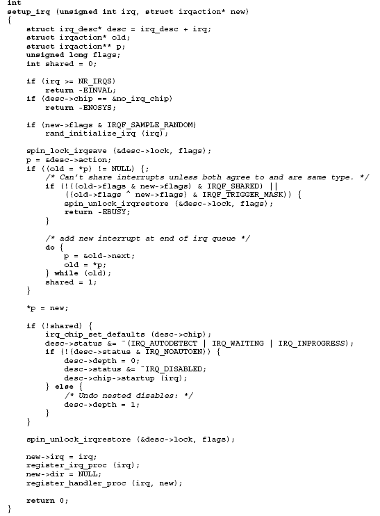

> Note: `irq_chip_set_defaults(desc->chip);`

</details>

<details markdown="1">
<summary>Comments</summary>

- Start with a couple of sanity checks
- If random sampling flag is set
  - initialize as source of random numbers
  - good random numbers are hard to find!
  - devices such as disks can be used because of “random”
rotational latency to read data (for example)

---

- Critical section (most of function)
  - blocks other activity on descriptor
  - uses irqsave/restore to allow handlers to be added from any context
- Note that new action goes at the **end** of the linked list, not the start
- Interrupt chaining only allowed
  - if all handlers agree to it
  - otherwise only first handler is successfully added

---

- If this handler is the first
  - make sure that PIC jump table has proper default functions
  - clear some status flags
  - clear any previous software disablement (depth)
  - call the PIC startup function
- After critical section
  - create `/proc/irq/<irq#>` directory if necessary
  - add handler subdirectory in `/proc/irq/<irq#>/<action name>`

</details>

## `free_irq` function

<details markdown="1">
<summary>Code</summary>

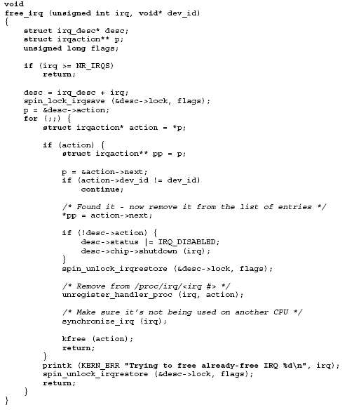

</details>

<details markdown="1">
<summary>Comments</summary>

- Arguments
  - irq - irq # (0-15 for PIC)
  - dev_id - MUST match pointer value used in request_irq call

- Start by checking arguments

- Critical section starts to prevent manipulations of descriptor
  - blocks interrupt from starting to execute
  - (interrupt may already be executing on another processor)
- Search for action in list
  - based on dev_id pointer
  - hence need for matching pointer
  - passing NULL dev_id not allowed with chained interrupts

- Once found (notice that most of the loop executes exactly once)
  - remove the action
  - if this action/handler was the last for this interrupt,
    - turn on software disablement
    - (doing so signals interrupts waiting for descriptor lock to abort once they obtain the lock)
    - call the PIC shutdown function

- Remove the `/proc/irq/<irq #>/<action name>` entry

- On an SMP
  - interrupt may be executing on another processor
  - need to wait for it to finish after releasing descriptor lock

- Finally, free the action structure

</details>

## Interrupt Invocation

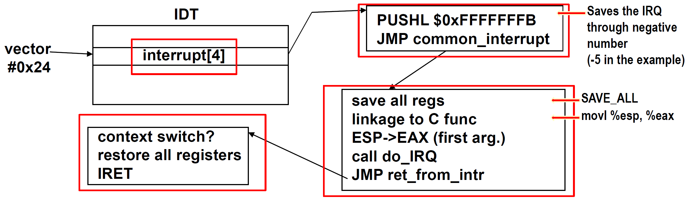{: .w-75}

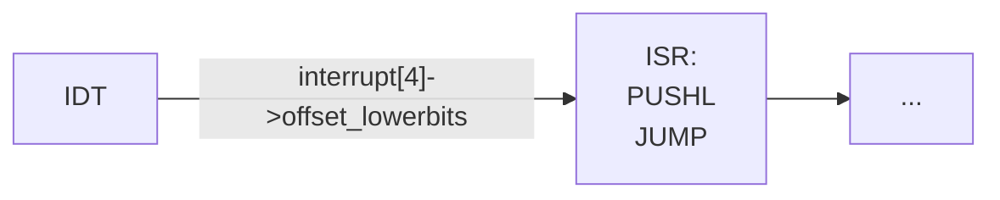
```mermaid
flowchart LR
    IDT -->|"interrupt[4]->offset_lowerbits"| ISR["ISR:\nPUSHL\nJUMP"]
    ISR --> ...
```

see [irq_desc Array](#irq_desc-array)

**ISR : Interrupt Service Routine**

> Why funnel all IRQs into one piece of code(instead of producing one function per IRQ) ?
>
> : Kernel code/size versus speed tradeoff
{: .prompt-tip }

### Stack View

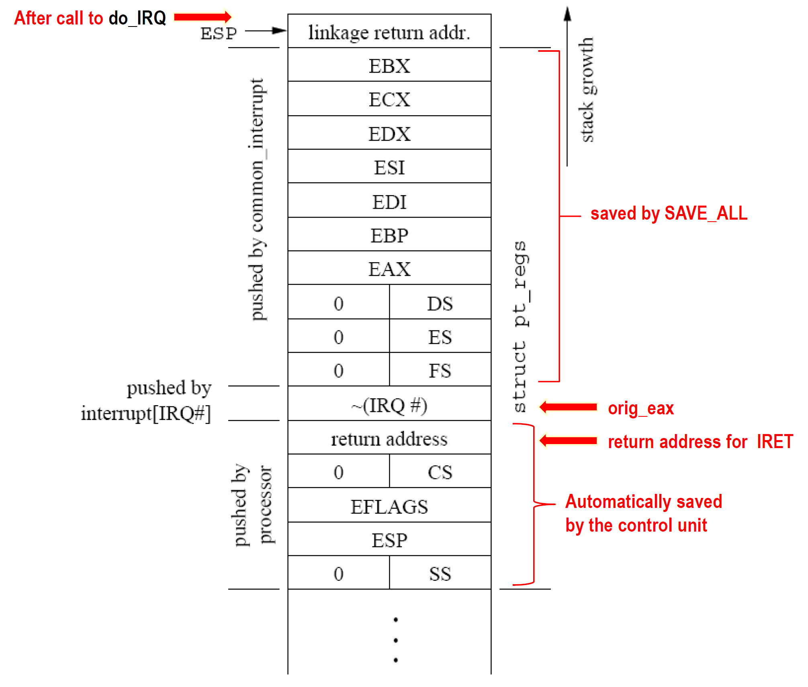{: .w-75}

> NOTE: registers pushed before the IRQ# are done by processor in `INT`, and is used together with `IRET`.

## IDT

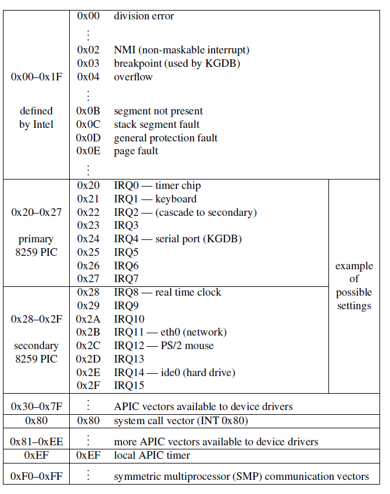{: .w-75}

```c
struct idt_entry {
    unsigned short int offset_lowerbits; // ISR的低16位偏移量
    unsigned short int selector;        // GDT段选择子
    unsigned char zero;                 // 置零字段
    unsigned char type_attr;            // 类型和属性
    unsigned short int offset_higherbits; // ISR的高16位偏移量
} __attribute__((packed));
```

- Associates the interrupt line with the int. handler routine.
- 256 entries (descriptors) (each 8 bytes)
  - hardware **interrupt**: **vectors 0x20 to 0x2F**
- interrupt gates <-> descriptor
- **IF=0** when interrupt gate is invoked
- use `lidt` instruction to load
- init IDT in `setup_idt()`

# 12 Linux interrupt system

## `irq_desc` Array

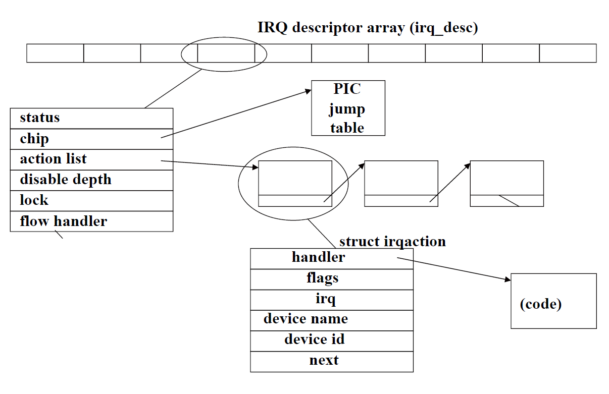{: .w-50}

- **Every interrupt vector** has its own `irq_desc_t` **descriptor**
- Descriptors are grouped together in `irq_desc` **array**, a data structure supported by Linux
- When a device driver calls the `request_irq()` [function](#request_irq-function) a new structure to represent the handler is allocated and initialized

<details markdown="1">
<summary>FYI</summary>

**IRQ descriptor array** (irq_desc): 这是一个数组，每个条目对应一个中断号（IRQ）。它是内核用来快速索引每个中断服务例程的中心数据结构。

**PIC jump table**: 这通常指的是可编程中断控制器（Programmable Interrupt Controller）的跳转表，它决定了硬件中断信号如何映射到CPU中断线。

**struct irqaction**: 这是一个结构体，描述了中断的处理程序（handler），以及处理程序的属性（如flags），相关的IRQ号，设备名，设备ID，以及其他可能的irqaction结构体形成的链表（next指针）。

**handler**: 这个部分指向处理该中断的具体函数。

**code**: 这表示实际执行的中断处理代码。

**linked list**: 如果有多个处理程序与同一个IRQ号关联，它们会通过一个链表连接起来。

**status, chip, action list, disable depth, lock, flow handler**: 这些字段是irq_desc结构体的一部分，包含了中断的状态、关联的硬件芯片信息、行为列表、禁用深度（中断可以被禁用多次，每次调用disable都会增加这个计数）、锁定机制和流控制处理函数。

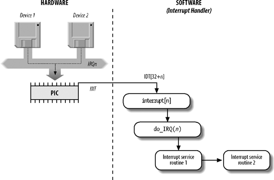{: .w-50}

</details>

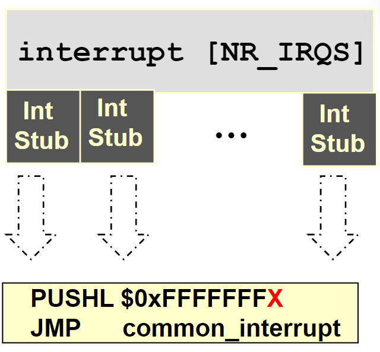{: .w-25}

Kernel maintains one **global array of function pointers** (`interrupt[NR_IRQS]`) in which it stores pointers to **interrupt stubs** (`NR_IRQS` is `16` if we use the **PIC**).

See [Interrupt Invocation](#interrupt-invocation)

## Initialization of Interrupt Gates

During initialization `init_IRQ ()` sets the status field of each
IRQ descriptor to `IRQ_DISABLED`.

Then `init_IRQ ()` do:

```c
for (i = 0; i < NR_IRQS; i++)
  if (i+32 != 128)
    set_intr_gate(i+32, interrupt[i]);
```

# 13 Soft Interrupts in Linux

- When are soft interrupts executed?
  - **after** a **hard interrupt** completes
  - periodically by a **daemon** in the kernel
- How?
  - seven or eight **prioritized types**, including high and low tasklet
priorities
  - **linked list** for each tasklet priority
  - run on processor on which interrupt is scheduled
  - each handler **atomic** with respect to itself (only)

## Declaring a handler

```c
DECLARE_TASKLET (name, func , data);
```

- `name`: name of `tasklet_struct` to be declared
- `data`: an `unsigned long`
- `func`: `void (*func) (unsigned long);`

the `tasklet_struct` structure:

```c
struct tasklet_struct {
    struct tasklet_struct *next;  // next tasklet
    unsigned long state;          // status of tasklet: TASKLET_STATE_SCHED, TASKLET_STATE_RUN
    atomic_t count;               // # of disables
    void (*func)(unsigned long);  // pointer to the tasklet function
    unsigned long data;           // integer which can be used by the tasklet function
};
```

The following two calls schedule a tasklet for execution:

```c
// schedules tasklet at low priority on the executing processor
void tasklet_schedule (struct tasklet_struct* t);
// schedules at high priority
void tasklet_hi_schedule (struct tasklet_struct* t);
```

## Tasklet Execution

The `do_softirq call` call

- checks per-processor bit vector of pending priorities (high, low, etc.)
- executes action for each priority (`softirq_vec`)
- `tasklet_action` walks through linked list
  <br>`tasklet_hi_action` walks through high-priority list
- repeats up to 10 times or until no softirqs are raised

### Atomicity

Two bits in state changed atomically

- `TASKLET_STATE_SCHED` tasklet **scheduled** for execution
- `TASKLET_STATE_RUN` tasklet **executing** on some processor

When scheduling

- set `TASKLET_STATE_SCHED` atomically
  <br>if already set, schedule call **does nothing**

<details markdown="1">
<summary>Execution Graph</summary>

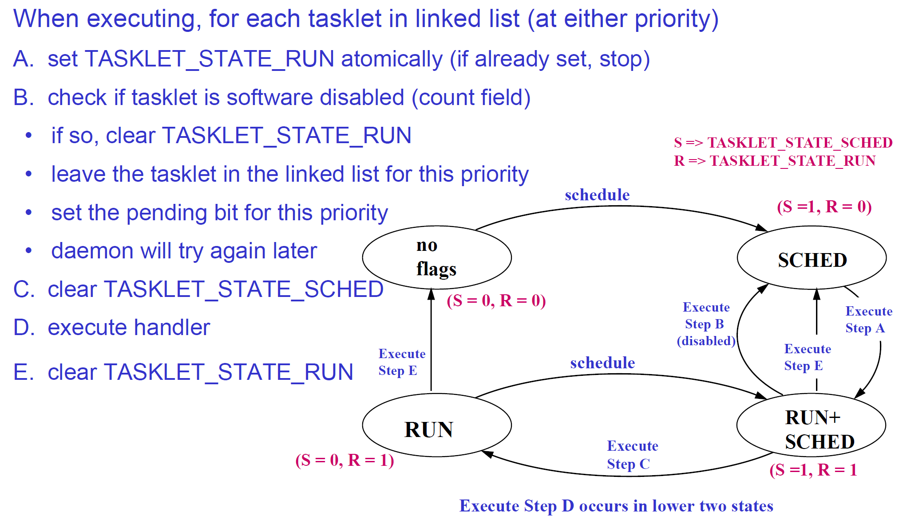{: .w-75}

</details>

# 14 Virtual Memory

What is virtual memory?

- **indirection** between memory addresses seen by software and those
used by hardware
- typically done with **large blocks**, e.g., **4kB** or **4MB** in x86

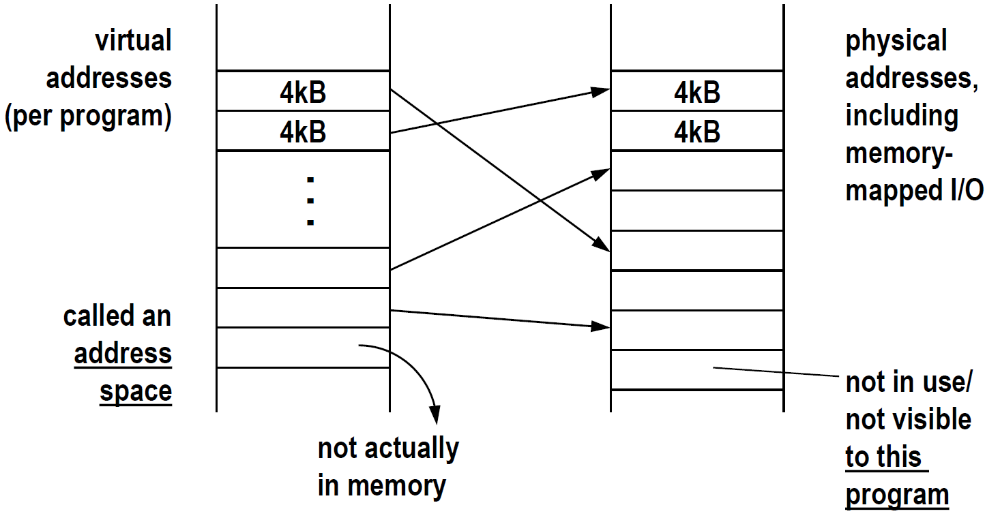{: .w-50}

Why use virtual memory? *(in decreasing order of importance)*

- **protection**
  - one program **cannot** accidentally or deliberately **destroy** another’s data
  - the memory is simply **not accessible**
- more effective **sharing**
  - two (or more) programs that share library code can **share a single copy
of the code** in physical memory
  - code and data not actively used by a program
    - can be **pushed out to disk** to make room for other programs’ active data
    - provides the illusion of a much larger physical memory

- no fragmentation
- simplifies program loading and execution: no relocation of code

## x86 Protection Model

level| meaning
---|---
CPL | **current privilege level** (of executing code)
RPL | **requestor’s** privilege level;<br>when code at high privilege level executes on behalf of code at lower level, some accesses may voluntarily lower privilege to that of caller/beneficiary
DPL | **descriptor privilege level**; level **necessary** to execute code/data

if `MAX(CPL,RPL) > DPL` (privilege too low), processor generates an **exception** (`general protection fault`)

## Segmentation


```mermaid
flowchart LR
    A[logical address]
    B[linear address]
    C[physical address]
    A -->|segmentation unit| B
    B -->|paging unit| C
```

Two levels of indirection. Segmentation is **unused**.

x86 in **protected mode** always uses segmentation.

## Segment Selectors

A **logical address** consists of two parts:

- (**16-bits**) A **segment selector**<br>{: .w-25}<br>$2^{13}=8192$ entries max.
- (**32-bits**) An **offset** that specifies the relative address **within the segment**.

<!-- segmentation register (16-bits length):

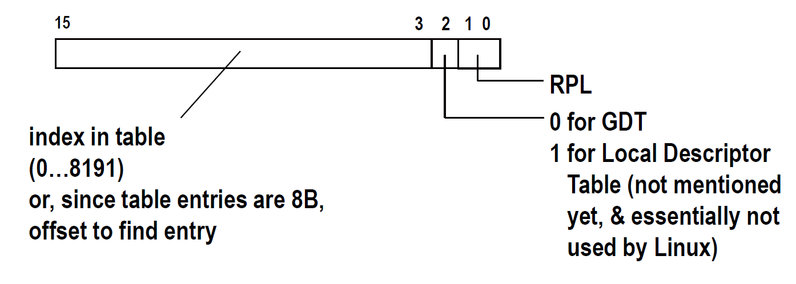{: .w-50} -->

### Segmentation Registers store Segment Selectors

register|segment
---|---
CS | **code** segment register (includes a 2-bit field that specifies the Current Privilege Level (**CPL**) of the CPU)
DS | **data** segment register
SS | **stack** segment register
ES | extra data segment register
FS | extra data segment register
GS | extra data segment register

> Each segment register has **16 bits visible** + **~64 bits shadow** (not accessible via ISA) that cache the **description of the segment #** referenced by the visible 16 bits.
{: .prompt-tip }

## Segment Descriptors

Each segment is represented by an 8-byte Segment Descriptor that describes the segment characteristics.

- Code Segment Descriptor
- Data Segment Descriptor
- Task State Segment Descriptor (TSSD)

<details markdown="1">
<summary>Different Types</summary>

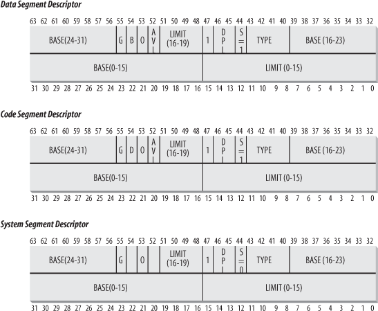{: .w-75}

</details>

### Global descriptor table (GDT)

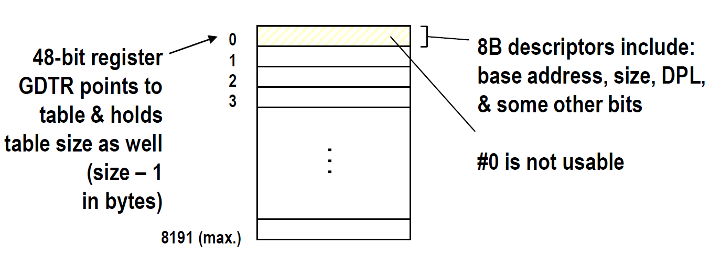{: .w-50}

<details markdown="1">
<summary>Segment Descriptor fields</summary>

Field name | Description
--- | ---
Base | Contains the linear address of the first byte of the segment.
G | Granularity flag: if it is cleared (equal to 0), the segment size is expressed in bytes; otherwise, it is expressed in multiples of 4096 bytes.
Limit | Holds the offset of the last memory cell in the segment, thus binding the segment length. When G is set to 0, the size of a segment may vary between 1 byte and 1 MB; otherwise, it may vary between 4 KB and 4 GB.
S | System flag: if it is cleared, the segment is a system segment that stores critical data structures such as the Local Descriptor Table; otherwise, it is a normal code or data segment.
Type | Characterizes the segment type and its access rights (see the text that follows this table).
DPL | Descriptor Privilege Level: used to restrict accesses to the segment. It represents the minimal CPU privilege level requested for accessing the segment. Therefore, a segment with its DPL set to 0 is accessible only when the CPL is 0 — that is, in Kernel Mode — while a segment with its DPL set to 3 is accessible with every CPL value.
P | Segment-Present flag : is equal to 0 if the segment is not stored currently in main memory. Linux always sets this flag (bit 47) to 1, because it never swaps out whole segments to disk.
D or B | Called D or B depending on whether the segment contains code or data. Its meaning is slightly different in the two cases, but it is basically set (equal to 1) if the addresses used as segment offsets are 32 bits long, and it is cleared if they are 16 bits long (see the Intel manual for further details).
AVL | May be used by the operating system, but it is ignored by Linux.

</details>

#### `gdtr` register: 48 bits in total

- 32-bits: base address of GDT
- 16 bits: limit (in Byte) (max = $2^{16}$ Bytes)

### Local Descriptor Table (LDT)

LDT originally meant to be per task segment tables

`LDTR` points to current LDT

## Segmentation Unit

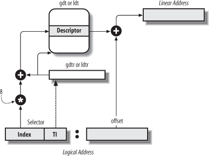{: .w-50}

## Segmentation in Linux

Segment | Base | G | Limit | S | Type | DPL | D/B | P
---|---|---|---|---|---|---|---|---
user code | `0x00000000` | 1 | `0xfffff` | 1 | 10 | 3 | 1 | 1
user data | `0x00000000` | 1 | `0xfffff` | 1 | 2 | 3 | 1 | 1
kernel code | `0x00000000` | 1 | `0xfffff` | 1 | 10 | 0 | 1 | 1
kernel data | `0x00000000` | 1 | `0xfffff` | 1 | 2 | 0 | 1 | 1

### The Linux GDT

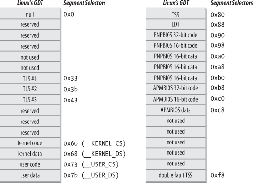 {: .w-75}

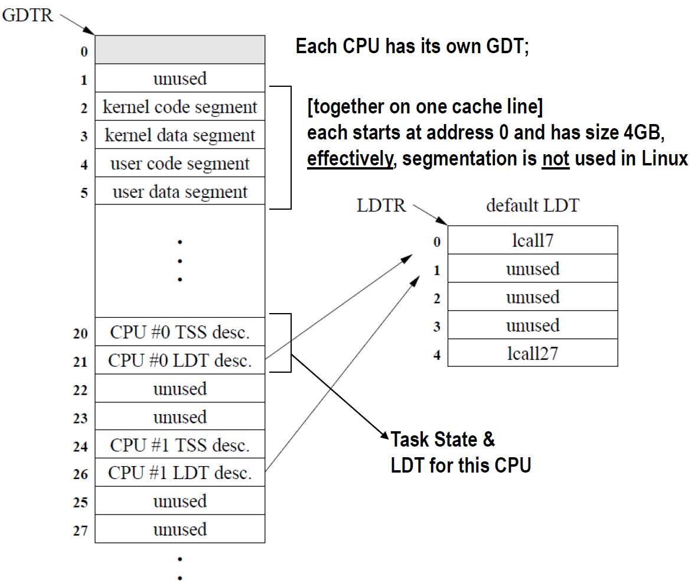{: .w-75}

### The Linux LDT

Mostly do not use.

### Privilege Check for Data Access

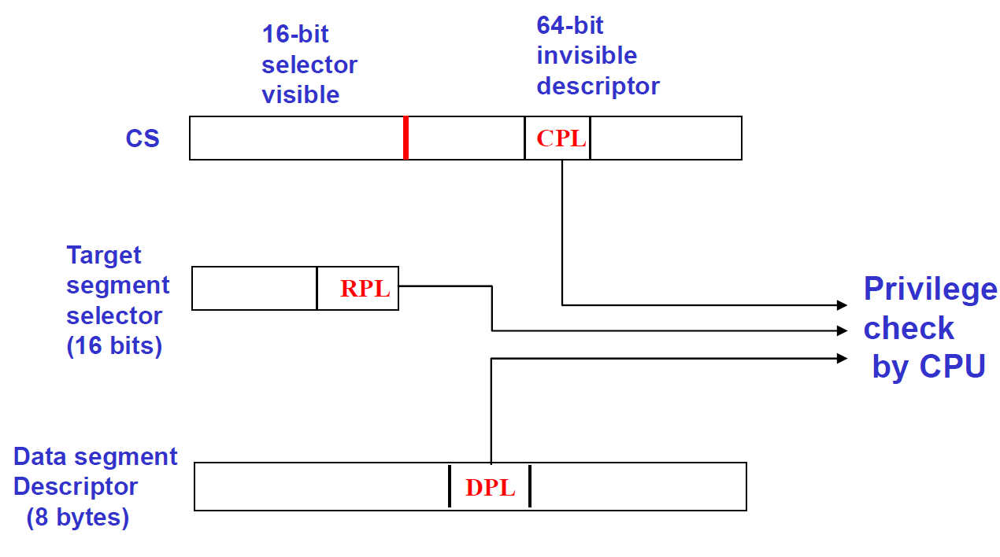{: .w-50}

Code can read data iff **max(CPL, RPL) < DPL**.

## Paging

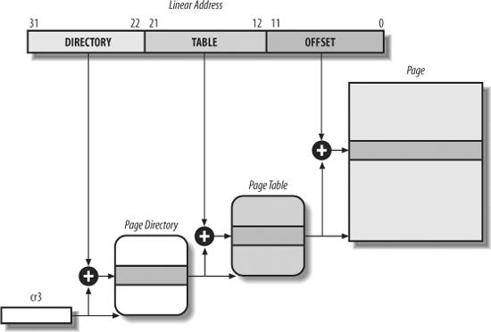{: .w-50}

> The page table is just another 4kB page, it holds 4096 / 4 = 1024 PTEs
{: .prompt-tip }

---

---

---

# 24 signals

Signals are the user level analogue of interrupts

Similarities

- **asynchronous** w.r.t . program execution
- **not queued** like a physical line; sending twice may cause
   handler to execute once or twice
- can be **ignored**, blocked, or caught
- but has some **NMIs** (`SIGKILL`, `SIGSTOP`)
- **handler** can be changed from default
- only data given to handler is **signal #** (traditional model)
- signal is **(by default) blocked** while handler executes.

Differences
- generated by software (kernel or a program via a **system call**)
- no “device” associated with signal; only software with permission
can send a signal (single permission allows **any** signal to be sent)
- further differences with POSIX (Portable Operating System Interface)
model (as opposed to traditional model)
  - new real time signals are queued 
  - can be sent to threads or processes (to any thread in a process)
  - `siginfo` structure contains additional information about the signal
(e.g., address of exception)

| Signal Name | Default Action | Comment                                      |
|-------------|----------------|----------------------------------------------|
| SIGINT      | Terminate      | Interrupt from keyboard, Control-C           |
| SIGABRT     | Dump           | Abnormal termination                         |
| SIGIOT      | Dump           | Equivalent to SIGABRT                        |
| SIGKILL     | Terminate      | Forced-process termination                   |
| SIGSEGV     | Dump           | Invalid memory reference                     |
| SIGPIPE     | Terminate      | Write to pipe with no readers                |
| SIGALRM     | Terminate      | Real-timer clock                             |
| SIGTERM     | Terminate      | Process termination                          |
| SIGCONT     | Continue       | Resume execution, if stopped                 |
| SIGSTOP     | Stop           | Stop process execution, Ctrl-Z               |
| SIGVTALRM   | Terminate      | Virtual timer clock                          |
| SIGIO       | Terminate      | I/O now possible                             |
| SIGPOLL     | Terminate      | Equivalent to SIGIO                          |
| SIGSYS      | Dump           | Bad system call                              |


## Signal Behavior

- Set to default by kernel
- Controlled by user program
- Stored in kernel (data struct `sigaction`)
- Used by kernel

```c
struct sigaction {
  void (*sa_handler)(int); // traditional
  void (*sa_sigaction)(int, siginfo_t*, void*); // POSIX
  sigset_t sa_mask; // signals to mask while executing
  int sa_flags;
};
```

### Signal Behavior Control API

`int sigaction (int signum, struct sigaction* newact, struct sigaction* oldact); ` read/replace signal behavior

`int sigprocmask (int how, sigset_t* set, sigset_t* oldset);` set bit vector of blocked signals


