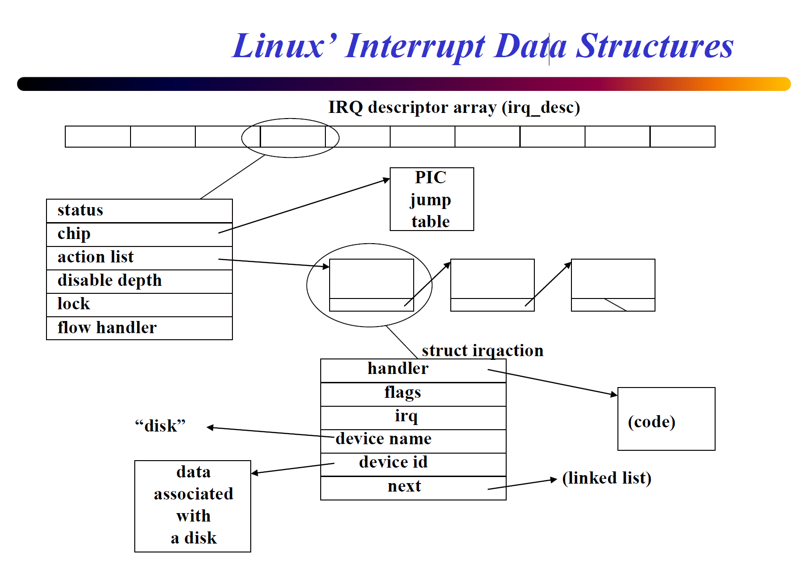

## 0 intro

fuck you ans kiss my ass.

## 9 Programmable interrupt controller (PIC)

### Motivation

Connect (more then 1)    devices to processor's interrupt input.

> Why not use a OR gate?
>
> no way to tell which device
{: .prompt-tip }

### Overview

- `A` = address match for ports
- `CS’` = chip select (does processor want PIC to read/write?)
- `RD’` and `WR’` defined from processor’s point of view
  - `RD’` = processor will read data (vector #) from PIC
  - `WR’` = processor will write data (command, EOI) to PIC

Ports: `0x20` & `0x21`

- `0x20`: command port
- `0x21`: data port

i.e. `CS'` only enabled when `ADDR` is `0x20` or `0x21`.

prioritization on 8259A: 0 is high, 7 is low

### Steps

When a device **raises an interrupt**...

- check if priority is higher than those of in service interrupts
- if not, do nothing
- if so
  - report the highest priority raised to the processor
  - mark that device as being in service

When processor reports `EOI` (end of interrupt) for
some interrupt...

- remove the interrupt from the in service mask
- check for raised interrupt lines that should be reported to processor

How to report a interrupt?

- PIC raises `INTR`
- processor strobes `INTA’` (active low) repeatedly
  - creates cycles for PIC to write **vector** to data bus
  - (must follow spec timing! PIC is not infinitely fast.)
- processor sends `EOI` with specific combinations of A & D inputs (A is from address bus, D is from data bus)

### Cascading

Up to 8x8=64 devices with cascading.

#### Architecture

secondary 8259A: ports `0xA0` & `0xA1`

secondary PIC & primary PIC:

- share `D` and `INTA'`
- secondary PIC connects to `IR2` on primary PIC.
- `SP'`: low -> secondary PIC; 1 -> primary PIC.
- `CAS` 3bit, indicate which secondary PIC (8 PIC's max) to respond on data bus.

<!-- 

  
Linux 8259A Initialization Code
 -->

1. What is the auto_eoi parameter? always = 0
2. Four initialization control words to set up primary 8259A
3. Four initialization control words to set up secondary 8259A

|ICW|port(A=?)|info contained in Initialization Control Word|
|---|---|---|
|ICW1|0|start init, edge triggered inputs, cascade mode, 4 ICWs |
|ICW2|1|high bits of vector # |
|ICW3|1|primary PIC: bit vector of secondary PIC secondary PIC: input pin on primary PIC |
|ICW4|1|ISA=x86, normal/auto EOI |

> Other details

<!-- 
 -->

## 10 Linux abstraction of PIC

Linux use a **jump table** (NOT IDT) `hw_irq_controller` for each vector number.

The table is used to interact with appropriate PIC.

|`hw_irq_controller`| function | Comment |
|:---|:---|:---|
|human readable name | `const char* name;` | e.g. “XTPIC” PIC”; see `/proc/interrupts`{: .filepath} |
|startup function | `unsigned int (*startup)(unsigned int irq);` | called when first handler is `installed` for an interrupt; change the corresponding `mask bit` in 8259A |
|shutdown function | `void (*shutdown)(unsigned int irq);` | called after last handler is `removed` for an interrupt; change the corresponding `mask bit` in 8259A |
|enable function | `void (*enable)...` |  |
|disable function | `void (*disable)...` |  |
|mask function|  |  |
|mask_ack function|  |  |
|unmask function |  |  |
|(+ several others…) |  |  |

Also

- `void (*ack) ...`, called at start of interrupt handling to ack receipt of the interrupt (sends EOI to PIC).
- `void (*end)...`, called at end of interrupt handling (on 8259, enables interrupt (unmasks it) on PIC).

*Initially, all 8259A interrupts are masked out using mask on 8259A (then use startup / shutdown function...).

## 10 General interrupt abstractions

### Interrupt Chaining

#### Motivation

Problems:

- may have > 15 devices.
- 1 deivce may be reponded by >1 hendler.

#### ~~One approach~~

Form a linked list for handlers.

bad:

- no way to remove self unless you’re first in list

#### Solution

interrupt chaining with linked list data structure.

#### Drawbacks of chaining

- for > 1 device: must query devices to see if they raised interrupt
- for 1 device: must avoid stealing data/confusing device

### Soft Interrupts

**software** generated (soft) interrupt. runs at priority **between program and hard interrupts**, **has no access to INTR pin!**

Usually generated by hard interrupt handlers to do work not involving device

> hardware interrupt (1st stage) need to be fast
> 
> tasklet (2nd stage) can be triggered by hardware interrupt handlers and do tasks that not involving the device.

Linux version is called **tasklets**.

example: network encryption/decryption, decrypter want to interrupt program.

#### Solution

## 11 Linux interrupt system

> **IRQ descriptor array** (irq_desc): 这是一个数组，每个条目对应一个中断号（IRQ）。它是内核用来快速索引每个中断服务例程的中心数据结构。
> 
> **PIC jump table**: 这通常指的是可编程中断控制器（Programmable Interrupt Controller）的跳转表，它决定了硬件中断信号如何映射到CPU中断线。
> 
> **struct irqaction**: 这是一个结构体，描述了中断的处理程序（handler），以及处理程序的属性（如flags），相关的IRQ号，设备名，设备ID，以及其他可能的irqaction结构体形成的链表（next指针）。
> 
> **handler**: 这个部分指向处理该中断的具体函数。
> 
> **code**: 这表示实际执行的中断处理代码。
> 
> **linked list**: 如果有多个处理程序与同一个IRQ号关联，它们会通过一个链表连接起来。
> 
> **status, chip, action list, disable depth, lock, flow handler**: 这些字段是irq_desc结构体的一部分，包含了中断的状态、关联的硬件芯片信息、行为列表、禁用深度（中断可以被禁用多次，每次调用disable都会增加这个计数）、锁定机制和流控制处理函数。
>

*chatGPT Answer*

`irq_desc` data structure

    
Toggle

Text in toggle

asdf