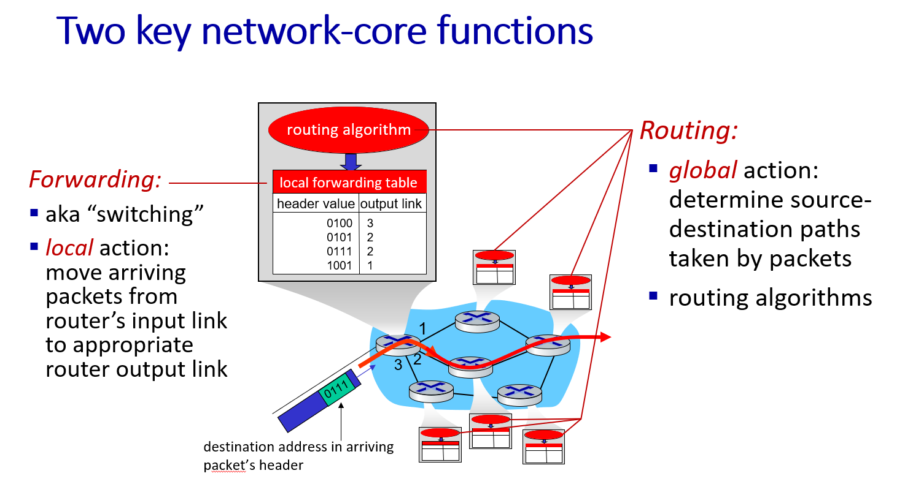
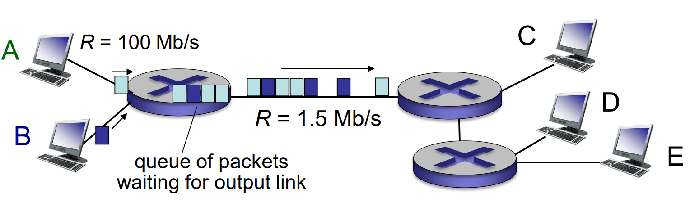
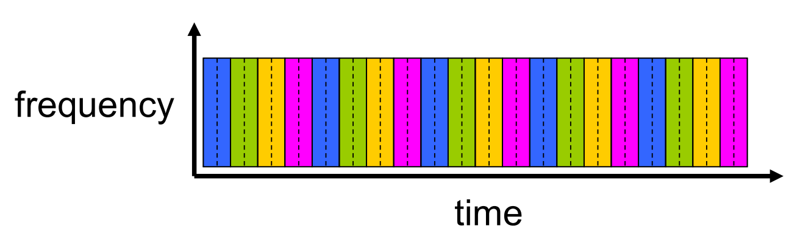
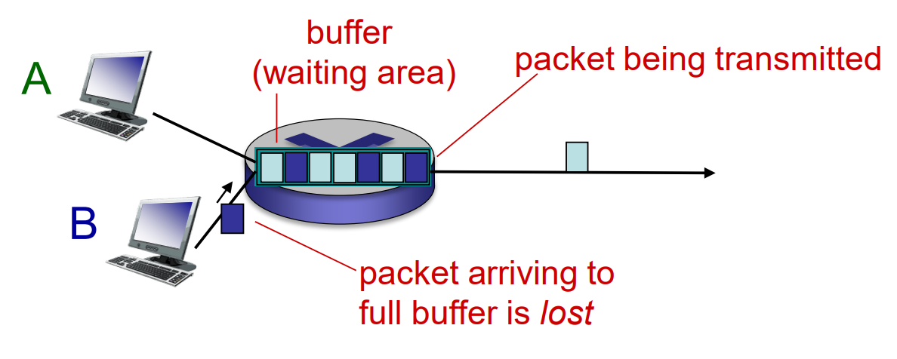
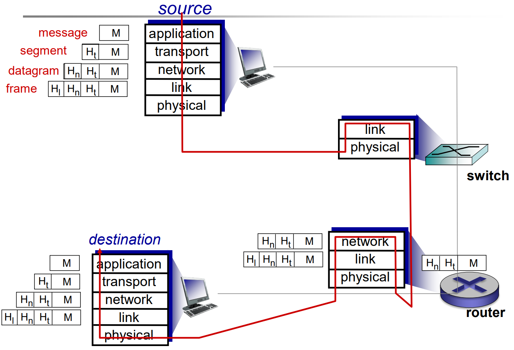

## Network-core

2 key functions:

- **routing**: **determine** source-destination **paths** taken by packets
- **forwarding** (**switching**): move arriving packets from router’s input link to appropriate router output link

### Packet-switching: Store-and-Forward

- **entire** packet must arrive at router before it can be transmitted on next link
- end-end delay = $2L/R$ (assuming zero propagation delay)

### Packet Switching: Queueing Delay, Loss

- if arrival rate > transmission rate,
  - packets will queue
  - packets can be dropped (lost) if memory (buffer) fills up

### Alternative core: Circuit Switching

- FDM: Frequency Division Multiplexing
  - {: w="30"}
- TDM: Time Division Multiplexing
  - {: w="30"}

### Internet Structure: Network of Networks

- IXP: Internet exchange point

## Delay, Loss, Throughput in networks

- packet arrival rate to link (temporarily) exceeds output link capacity
- packets queue, wait for turn

- packet being transmitted (**delay**)
- packets queueing (**delay**)
- free (available) buffers: arriving packets dropped (**loss**) if no free buffers

### Delay

- $d_{\text{proc}}$ nodal processing delay < msec
  - check bit errors
  - determine output link
- $d_{\text{queue}}$ queueing delay
  - time waiting at output link for transmission
  - $R$: link bandwidth (bps)
  - $L$: packet length (bits)
  - $a$: average packet arrival rate
  - $La/R\to 0$: avg delay small
  - $La/R\to 1$: avg delay large
  - $La/R> 1$: avg delay infinite
- $d_{\text{trans}}$  transmission delay
  - **time to upload bits**
  - $L$: packet length (bits)
  - $R$: link bandwidth (bps)
  - $d_{\text{trans}} = L/R$
- $d_{\text{prop}}$ propagation delay:
  - **time to propagate bits from A to B**
  - $d$: length of physical link
  - $v$: propagation speed
  - $d_{\text{prop}} = d/v$

### Loss

### Throughput

- throughput: rate (bits/time unit) at which bits transferred.
- bottleneck link: link on end-end path that constrains end-end throughput

---

## Internet protocol stack

|layer|use|
|---|---|
|application|supporting network applications (FTP, SMTP, HTTP)|
|transport|process-process data transfer (TCP, UDP)|
|network|routing of packets from source to destination (IP, routing protocols)|
|link|data transfer between neighboring network elements (Ethernet, 802.11 (WiFi), PPP)
|physical|bits on the wire|

- Switch
  - level 2 device
  - connects devices on a computer network by using packet switching to receive and forward data to the destination device.
- Router
  - level 3 device
  - Routers perform the traffic directing functions between networks and on the global Internet.