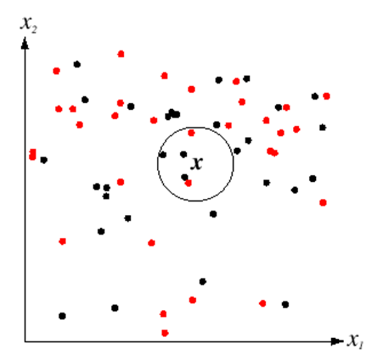
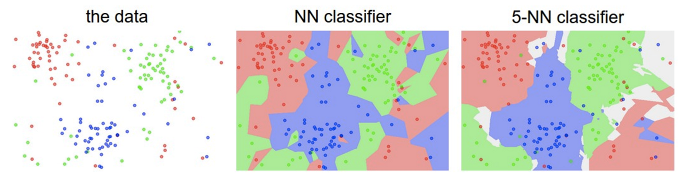
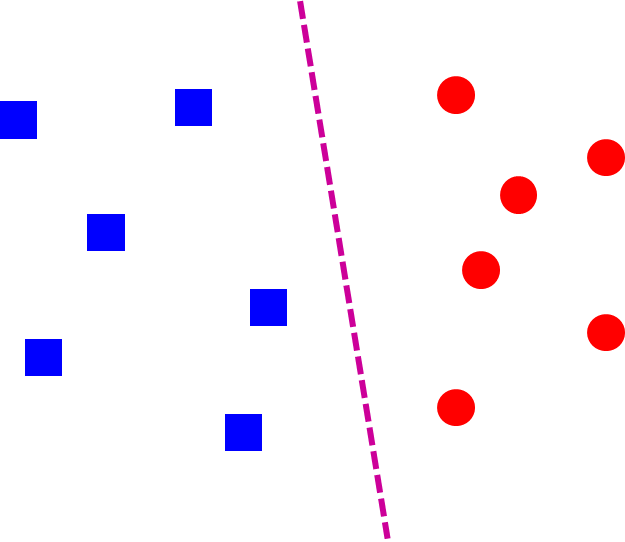
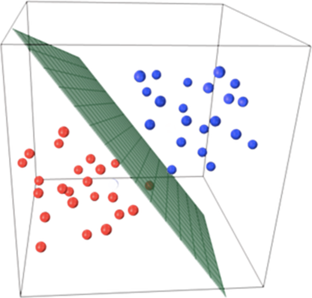

## The basic supervised learning framework

$$
y = f(x)
$$

- $y$: output
- $f$: prediction function
- $x$: input

training:

$$
{(x_1,𝑦1), …, (x_N,Y_N)}
$$

## Nearest neighbor classifier

$f(x)$ = label of the training example nearest to $x$

K-nearest neighbor classifier:

{: w="400"}

{: w="50%"}

## Linear classifier

{: w="400"}

{: w="400"}

$$
f(x) = \operatorname{sgn} (w\cdot x + b)
$$

NN vs. linear classifiers: Pros and cons

NN pros:

- Simple to implement
- Decision boundaries not necessarily linear
- Works for any number of classes
- Nonparametric method
NN cons:
- Need good distance function
- Slow at test time
Linear pros:
- Low-dimensional parametric representation
- Very fast at test time
Linear cons:
- Works for two classes
- How to train the linear function?
- What if data is not linearly separable?

## Empirical loss minimization

define expected loss

$$
L(f)=\mathbb{E}_{(x, y) \sim D}[l(f, x, y)]
$$

- $0-1$ loss
  - $l(f,x,y) = \mathbb{I}[f(x) \neq y]$ 
  - $L(f)=\operatorname{Pr}[f(x) \neq y]$
- $l_2$ loss
  - $l(f, x, y)=[f(x)-y]^2$
  - $L(f)=\mathbb{E}\left[[f(x)-y]^2\right]$
  
Find $f$ that minimizes

$$
\hat{L}(f)=\frac{1}{n} \sum_{i=1}^n l\left(f, x_i, y_i\right)
$$

