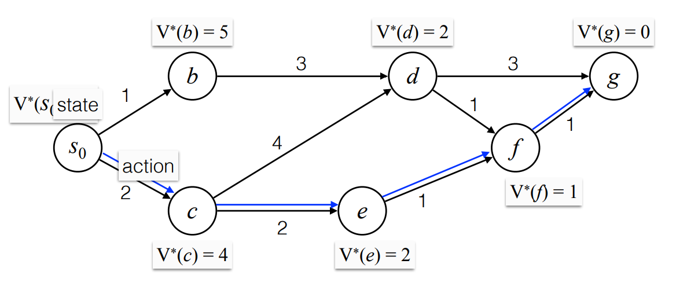
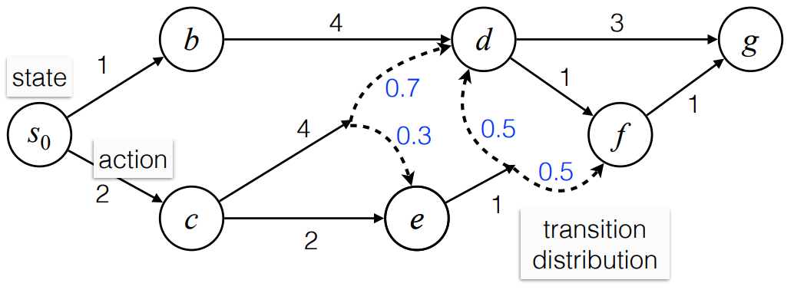
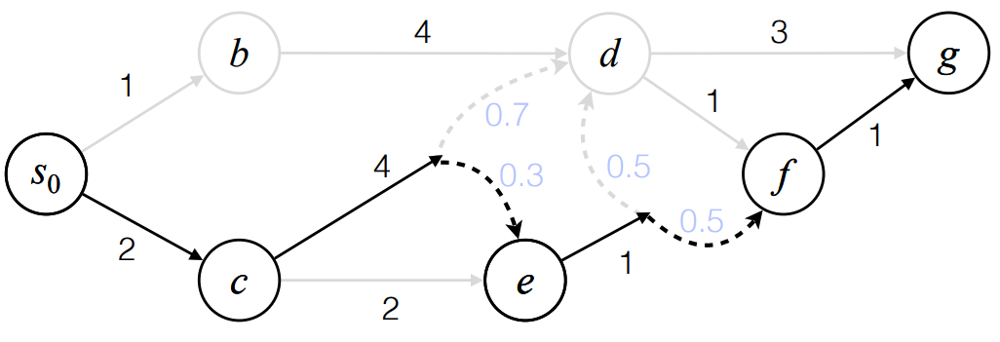
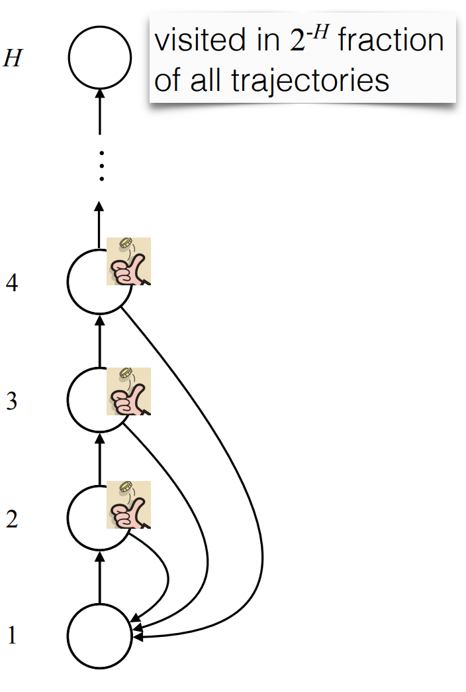
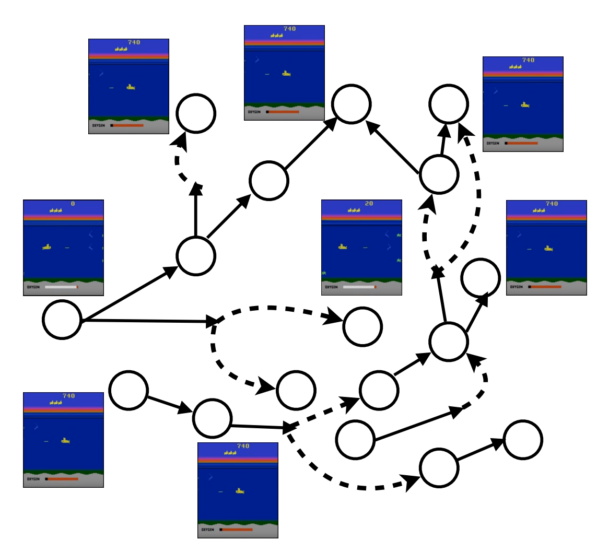

## example: Shortest Path

{: w="500"}
_Shortest Path_

- nodes: stats
- edges: actions

Greedy is not optimal.

**Bellman Equation** (Dynamic Programing):  

$$
V^*(d) = \min\{3 + V^*(g) ,\, 2 + V^*(f)\
$$

## Stochastic Shortest Path

Markov Decision Process (MDP)

{: w="500" }
_Stochastic Shortest Path_

**Bellman Equation**

$$
V^*(c) = \min\{4 + 0.7 × V^*(d) + 0.3 × V^*(e) ,\, 2 + V^*(e)\}
$$

optimal policy : $\pi^*$

## Model-based RL:

The states are unknown.
Learn by **trial-and-error**

{: w="500" }
_a trajectory: s0>c>e>F>G_

Need to recover the graph by collecting multiple **trajectories**.

Use imperial frequency to find probabilities.

Assume states & actions are visited uniformly.

### exploration problem

Random exploration can be inefficient:

{: h="400" }
_example: video game_

## example: video game

Objective: 

$$
\mathbb{E}\left[\sum_{t=1}^{\infty} r_t \mid \pi\right] \; \text{or} \;
\mathbb{E}\left[\sum_{t=1}^{\infty} \gamma^{t-1} r_t \mid \pi\right]
$$

Problem: the graph is too large

{: w="300" }

- there are states that the RL model have never seen.
- therefore need generalization
- 