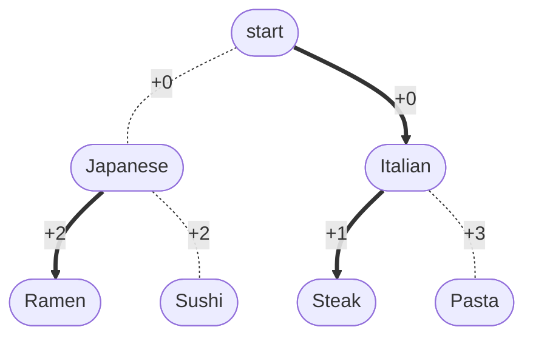
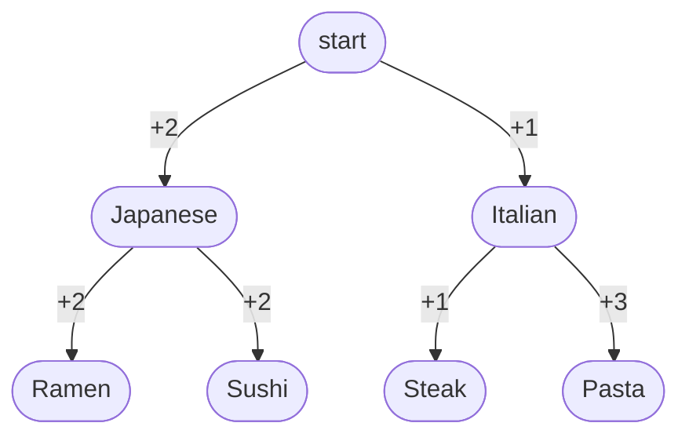
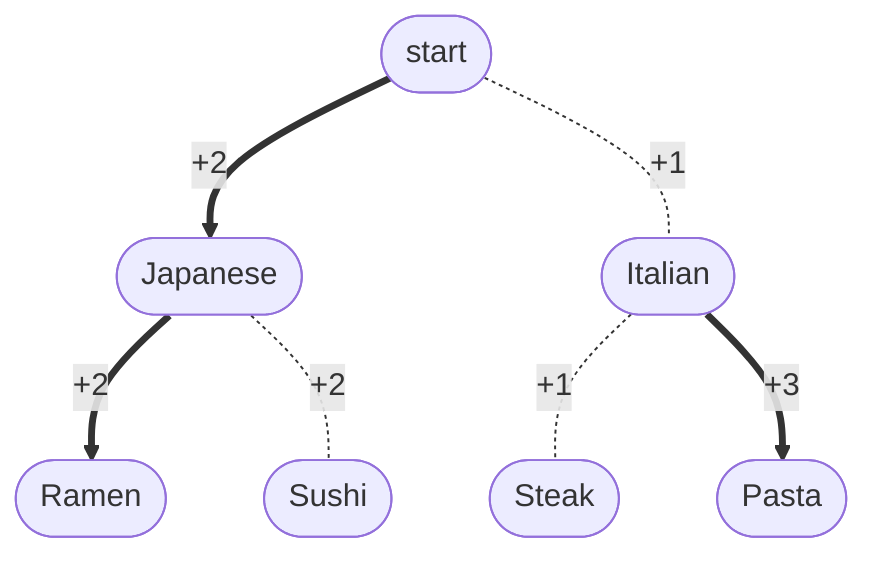
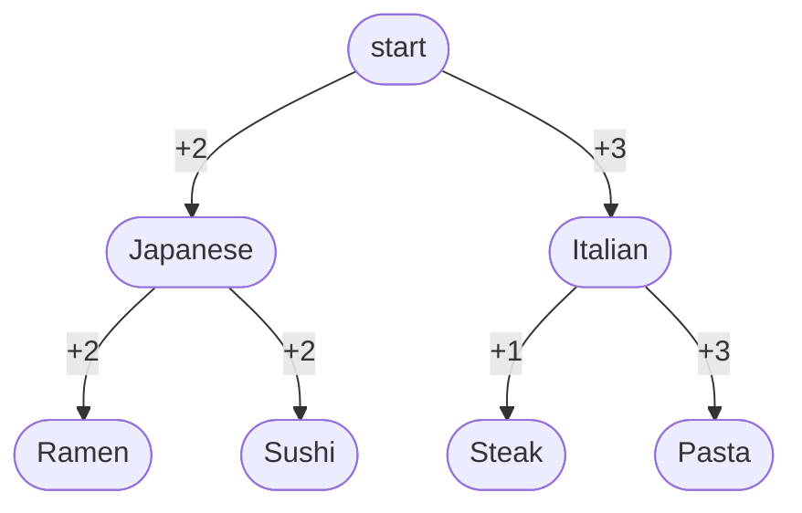
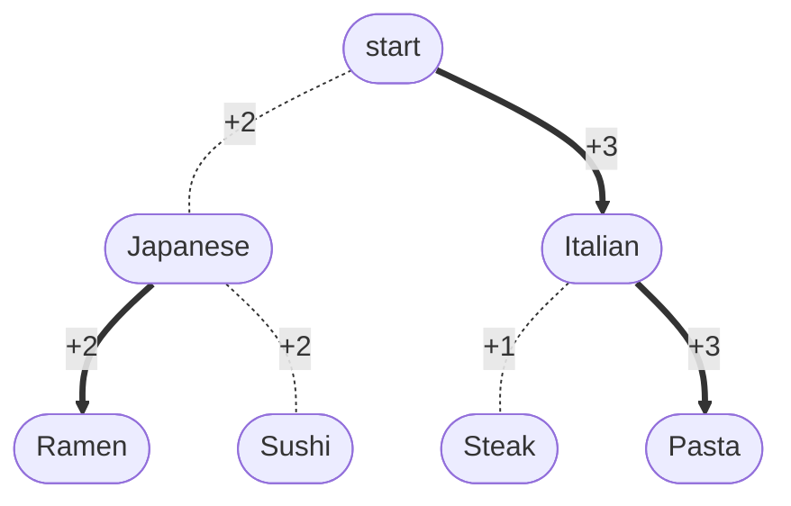

## Policy Iteration

$$
\pi_0: S \to A
$$

steps:

- policy evaluation: Compute $Q^{\pi_{k-1}}\in \mathbb{R}^{SA}$
- policy improvement: $\pi_k \leftarrow \pi_{Q^{\pi_{k-1}}}$ where

$$
\pi_{f{s}} = \argmax_{a \in A} f(s,a)
$$

property:

$$
\pi^*\to Q^{\pi^*}=Q^*\to \pi_{Q^*} =\pi^*
$$

> this means, once reached goal $\pi^*$, never leave.
{: .prompt-tip }

## example


Optimal policy is heading `Pasta`.

> This example is a finite horizon case.
> To make it infinite horizon discount, add a state $T$:
>
> ```mermaid
> graph TD;
>     A([start])
>     A -->|+0| B([Japanese])
>     A -->|+0| C([Italian])
>     B -->|+2| D([Ramen])
>     B -->|+2| E([Sushi])
>     C -->|+1| F([Steak])
>     C -->|+3| G([Pasta])
> 
>     D -.->|+0| T((T))
>     E -.->|+0| T((T))
>     F -.->|+0| T((T))
>     G -.->|+0| T((T))
>     T --->|+0| T((T))
> ```
>
{: .prompt-tip }

To find $V^*(s)$, update $V$ value from leaf upwards to root state.

### policy iteration (example)

#### interation #0

define initial $\pi_0$:



then the corresponding $Q^{\pi_0} (s, a)$:



#### interation #1

$$
\pi_1(s) := \arg\max_{a\in A} Q^{\pi_0} (s, a)
$$



$Q^{\pi_i}$:



#### interation #2

$$
\pi_2(s) := \arg\max_{a\in A} Q^{\pi_1} (s, a)
$$



