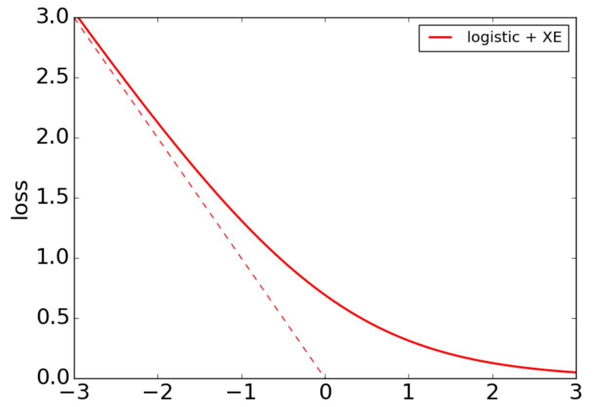
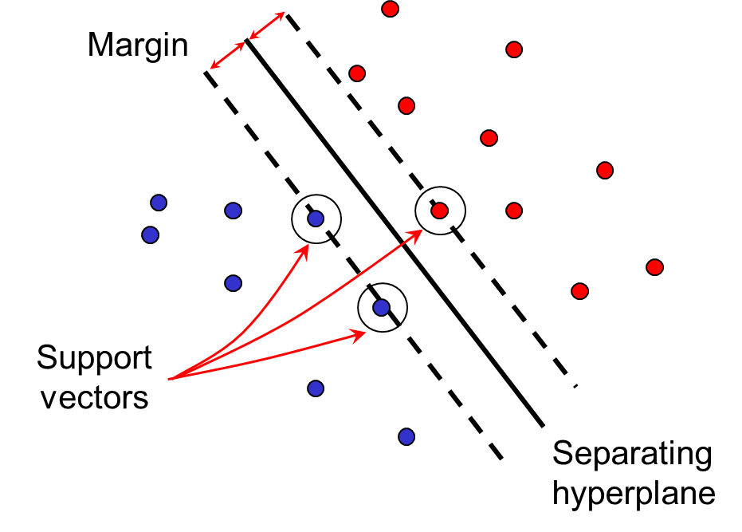
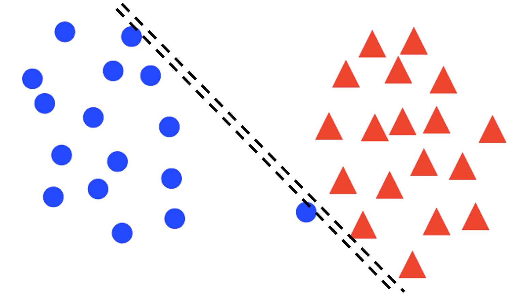
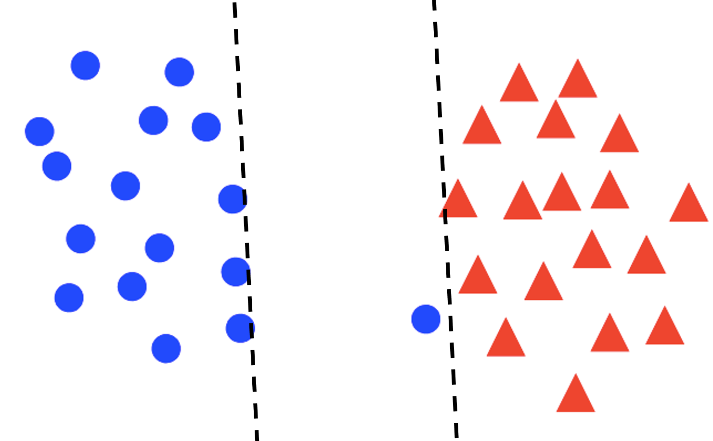
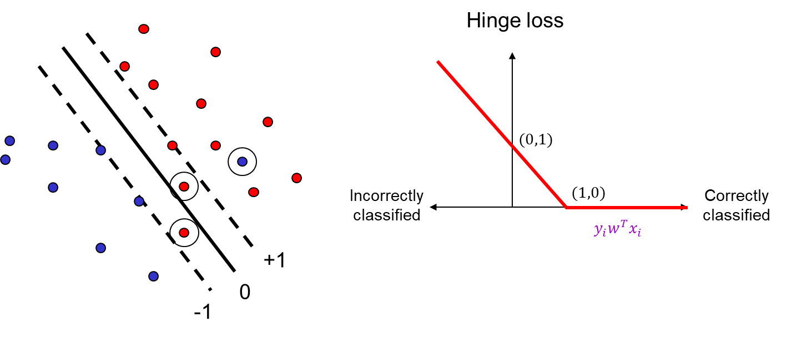

## Perceptron

Recall the sigmiod loss.

Define the perceptron hinge loss:

{: w="40000" }

$$
l\left(w, x_i, y_i\right)=\max \left(0,-y_i w^T x_i\right)
$$

Training process: find $w$ that minimizes (with SGD)

$$
\widehat{L}(w)=\frac{1}{n} \sum_{i=1}^n l\left(w, x_i, y_i\right)=\frac{1}{n} \sum_{i=1}^n \max \left(0,-y_i w^T x_i\right)
$$

The graident of perceptron loss is:

$$
\nabla l\left(w, x_i, y_i\right)=-\mathbb{I}\left[y_i w^T x_i<0\right] y_i x_i
$$

## Support vector machine (SVM)

maximize the distance between the hyperplane
and the closest training example, where the distance is given by $\frac{\left|w^T x_0\right|}{\|w\|}$.

{: w="400" }

### finding hyperplane

Assuming the data is linearly separable, we can fix the scale of $w$ so that $y_i w^T x_i=1$ for support vectors and $y_i w^T x_i \geq 1$ for all other points.

i.e. We want to maximize margin $\frac{1}{\|w\|}$ while correctly classifying all training data: $y_i w^T x_i \geq 1$, or

$$
\min _w \frac{1}{2}\|w\|^2 \quad \text { s.t. } \quad y_i w^T x_i \geq 1 \quad \forall i.
$$

### Soft margin

{: w="300" }

{: w="300" }

For non-separable and some separable data, we may prefer a **larger margin** with a few constraints violated.

$$
\min _w \underbrace{\frac{\lambda}{2}\|w\|^2}_{\substack{\text { Maximize margin }- \\ \text { (regularization) }}}+\underbrace{\sum_{i=1}^n \max \left[0,1-y_i w^T x_i\right]}_{\text {Minimize misclassification loss }}
$$

The loss is similar to the **perceptron loss**.

{: w="800" }
_SVM and Hinge loss_

This loss function tolerates wrongly classified points to get a larger margin.

### SGD update 

The loss function is $l\left(w, x_i, y_i\right)=\frac{\lambda}{2 n}\|w\|^2+\max \left[0,1-y_i w^T x_i\right]$ and its gradient is

$$
\nabla l\left(w, x_i, y_i\right)=\frac{\lambda}{n} w-\mathbb{I}\left[y_i w^T x_i<1\right] y_i x_i.
$$

## General recipe

empirical loss = empirical loss + data loss

$$
\hat{L}(w) \quad=\lambda R(w)+\frac{1}{n} \sum_{i=1}^n l\left(w, x_i, y_i\right)
$$

### regularization

- L2 regularization: $R(w)=\frac{1}{2}\|w\|_2^2$
- **L1 regularization**: $R(w)=\frac{1}{2}\|w\|_1 := 
\sum_d\left|w^{(d)}\right|$

The gradient of loss function with L1 regularization is

$$
\nabla \hat{L}(w)=\lambda \operatorname{sgn}(w)+\sum_{i=1}^n \nabla l\left(w, x_i, y_i\right)
$$

L1 regularization encourages sparsity weight.

