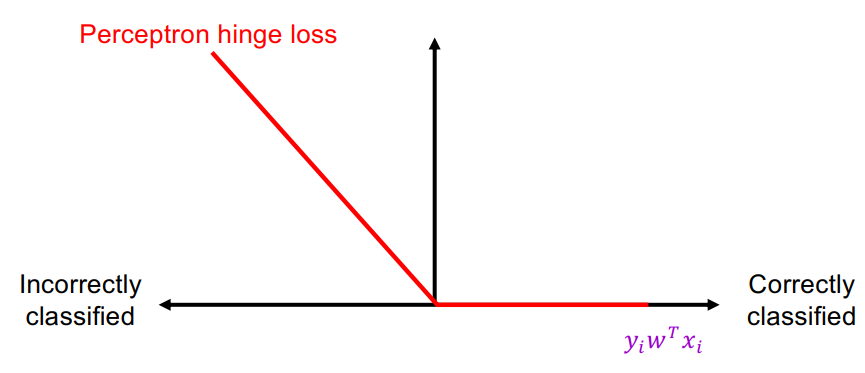

## Perceptron

Recall the sigmiod loss.

Define the perceptron hinge loss:

{: w="400" }

$$
l\left(w, x_i, y_i\right)=\max \left(0,-y_i w^T x_i\right)
$$

Training process: find $w$ that minimizes (with SGD)

$$
\widehat{L}(w)=\frac{1}{n} \sum_{i=1}^n l\left(w, x_i, y_i\right)=\frac{1}{n} \sum_{i=1}^n \max \left(0,-y_i w^T x_i\right)
$$

The graident of perceptron loss is:

$$
\nabla l\left(w, x_i, y_i\right)=-\mathbb{I}\left[y_i w^T x_i<0\right] y_i x_i
$$

