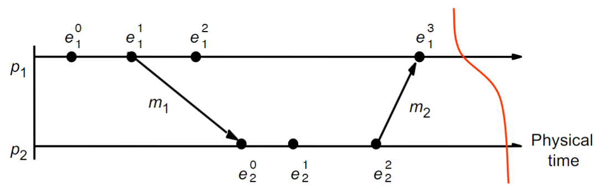
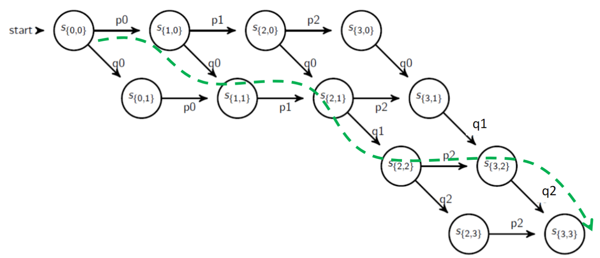
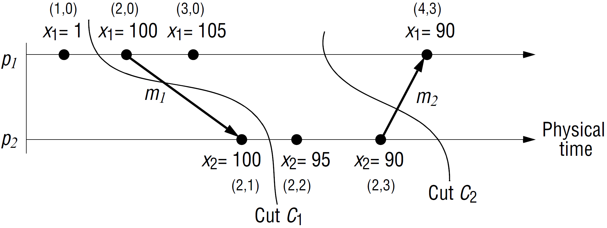

## Chandy-Lamport Algorithm

(Snapshot should not interfere with normal application actions, and it should not require application to stop sending messages.)

First, initiator $P_i$:

- records its own state
- creates a special marker message.
- for $j=1\ldots n, j\ne i$
  - $P_i$ sends a marker message on outgoing channel $c_{ij}$
  - start recording $c_{ji}$

For other process $P_i$ receiving a marked message from channel $c_{ki}$,

- if it is the first time $P_i$ see marked message
  - $P_i$ records its own state
  - marks the state of $c_{ki}$ as "empty"
  - for $j=1\ldots n, j\ne i$
    - $P_i$ sends a marked message over $c_{ij}$
    - if $j\ne k$
      - start recording $c_{ji}$
- else
  - stop recording $c_{ki}$ (the state of channel contains all messages during recording)

<video controls src="/upload/img/2024-02-21-distributed-system-5-output.mp4" title="Chandy-Lamport Algorithm" width="60%"></video>

Any run of the Chandy-Lamport Global Snapshot algorithm creates a consistent cut.

{: w="600" }

Proof.

- for every pair of causal messages $m_i \to m_j$ corresponding to process $P_i, P_j$, if $m_j$ is in the cut, then $m_i$ is also in the cut.
- prove by contracdition: if not, $m_i$ was sent before $P_j$ sending the marked message but arrive before it, then the cannel is not FIFO.

## linearization

- A run is a **total** ordering of events in the global history $H$ that is consistent with each $h_i$’s ordering.
• A linearization is a run consistent with happens-before
($\to$) relation in $H$.

{: w="600" }

- Run: $< e_1^0, e_1^1, e_1^2, e_1^3 , e_2^0, e_2^1 e_2^2 >$ (keeping the order within each process suffies)
- Linearization: $< e_1^0, e_1^1, e_1^2, e_2^0, e_2^1 e_2^2 , e_1^3 >$

### Execution Lattice

Each path represents a linearization.

{: w="600" }

{: w="250" }

An lattice of

{: w="500" }

{: w="300" }
