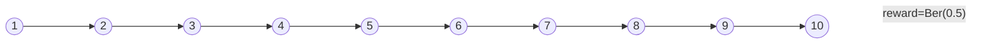

## A Question

We do $V_\theta(s)\leftarrow V_\theta(s) + \alpha(r-\gamma V_\theta\left(s^{\prime}\right) - V_\theta(s))$ in TD(0).

What if we minimize the square error between $V_\theta(s)$ and its target, i.e. $\mathbb{E}_{s, r, s^{\prime}}\left[\left(V_\theta(s)-r-\gamma V_\theta\left(s^{\prime}\right)\right)^2\right]$ ?

No correct. It can be [decomposed](./reinforcement-learning-homework-0/#proof) as the sum of 2 parts:

- $\mathbb{E}_s\left[\left(V_\theta(s)-\left(\mathscr{T}^\pi V_\theta\right)(s)\right)^2\right]$
  - good. It's L-2 norm Bellman Error.
- $\gamma^2 \mathbb{E}_s\left[\operatorname{Var}_{s^{\prime} \mid s, \pi(s)} \left[ V_\theta\left(s^{\prime}\right)\right]\right]$
  - Not good. It penalize policy with large variance.
  - OK for deterministic environment because the variance is always $0$ in this case.

### Solution

If we have a simulator, for each $s$ in data, draw another independent state transition.

Minimize objective

$$
\mathbb{E}\left[\left(V_\theta(s)-r-\gamma V_\theta\left(s_A^{\prime}\right)\right)\left(V_\theta(s)-r-\gamma V_\theta\left(s_B^{\prime}\right)\right]\right.
$$

<!-- i.e. uses 2 distinct variables $s_B'$, $s_C'$. -->

"Double sampling" and Baird's residual algorithm (Bellman residual minimization).

## Convergence

- TD with function approximation can diverge in general
- Is it because of...
  - Randomness in SGD?
    - Nope. Even the batch version doesn't converge
  - Sophisticated, non-linear func approx?
    - Nope. Even linear doesn't converge.
  - That our function class does not capture V"?
    - Nope. Even if V" can be exactly represented in the function class ("realizable"), it still does not converge.

### example

iterations

Iter   | 1     | 2     | ...    | 9     | 10
-------|-------|-------|--------|-------|-------
1      |       |       |        |       | 0.501
2      |       |       |        | 0.501 | 0.501
...    |       |       |        |       |
2      | 0.501 | 0.501 |  0.501 | 0.501 | 0.501

Assume the function space has to possible values at each state:

0.5   |0.5   | 0.5   | ... | 0.5   | 0.5   | 0.5
1.012 |0.756 |0.628  | ... | 0.504 | 0.502 | 0.501

