<https://birkhoffg.github.io/blog/posts/networking-what-is-networking/>

## Internet

Internet: "network of networks"

- Interconnected ISPs

Protocols control sending,receiving of messages

- e.g., TCP, IP, HTTP, Skype, 802.11 (WiFi)

Internet standards

- RFC: Request for comments
- IETF: Internet Engineering Task Force
- ISO, IEEE

---

## Internet Structure

Network edge:

- hosts: clients and servers
- servers often in data centers
- access networks, physical media: wired, wireless
  communication links
  
Network core:

- interconnected routers
- network of networks

Connect end systems to edge routers

- residential access nets
- institutional access networks (school, company)
- mobile access networks
- shared or dedicated?

### Access Network: Digital Subscriber Line (DSL)

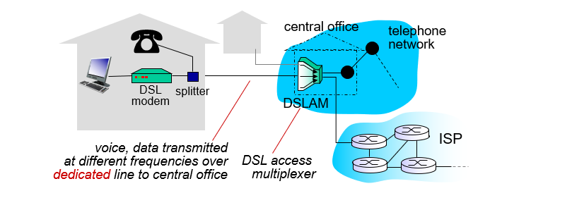=

- Use existing telephone line to central office DSLAM.
- dedicated access to central office
- < 2.5 Mbps upstream transmission rate (typically < 1 Mbps)
- < 24 Mbps downstream transmission rate (typically < 10 Mbps)

### Access Network: Cable Network

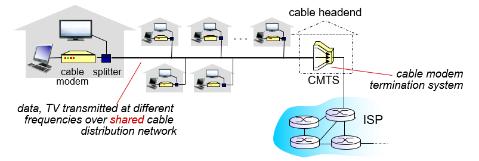

- Frequency division multiplexing: different channels transmitted in different frequency bands
- HFC: [hybrid fiber coax](https://en.wikipedia.org/wiki/Hybrid_fiber-coaxial) up to 30Mbps
- Network of cable, fiber attaches homes to ISProuter
- homes share network to cable headend

### Access Network: Home Network

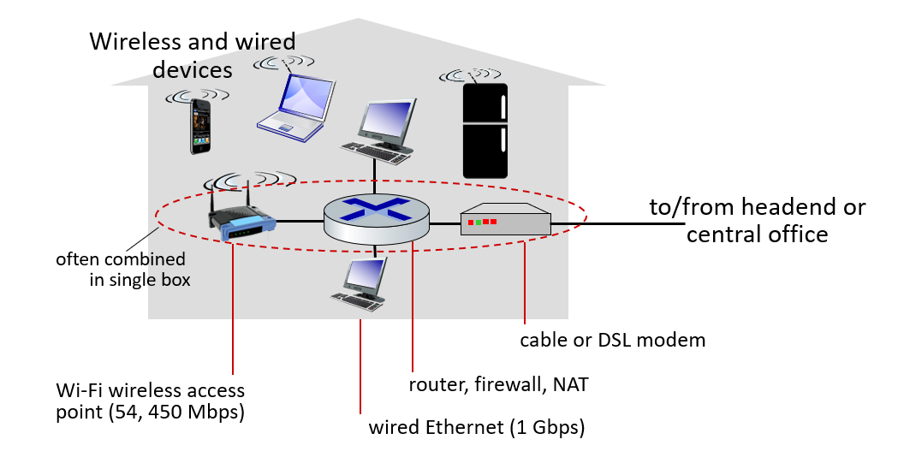

### Enterprise Access Networks (Ethernet)

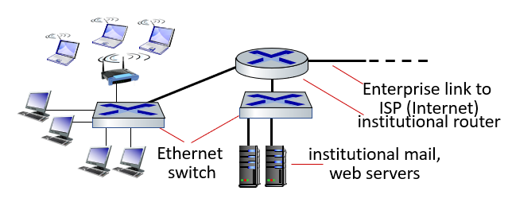

- 10 Mbps,100Mbps,1Gbps, 10Gbps transmission rates
- Today, end systems typically connect into Ethernet switch

### Wireless Access Networks

- Shared wireless access to base station aka "access point"

Wireless LANs (WiFi):

- 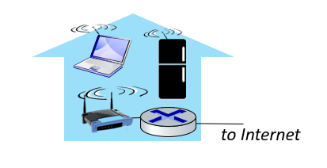{: w="40"}
- 11, 54, 450 Mbps rate

Wide-area wireless accesss

- 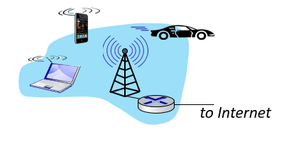{: w="40"}
- cellular operator, 10's km
- 1 to 10 Mbps
- 3G, 4G, [LTE](https://en.wikipedia.org/wiki/LTE_(telecommunication))

## Host: Sends Packets of Data

Host sending function:

- breaks appilication layer messages into smaller chunks (packets), of length $L$ bits
- transmits packet into access network at transmission rate $R$
- **link transmission rate / link capacity / link bandwidth**:

$$
\frac{L \text{ (bits)}}{R\text{ (bits/s)}}
$$

## Physical Media

guided media:

- signals propagate in solid media: copper,fiber,coax

unguided media:

- signals propagate freely
e.g., radio

twisted pair (TP)：

- two insulated copper Wires
- Category 5:100 Mbps1，Gbps Ethernet / Category 6: 10Gbps

Coaxial Cable:

- multiple channels

Fiber optic cable:

- high-speed point-to-point transmission (e.g.,10's-100's Gbps transmission rate)

## Network-core

2 key functions:

- routing
- forwarding

## Network-core

2 key functions:

- **routing**: **determine** source-destination **paths** taken by packets
- **forwarding** (**switching**): move arriving packets from router’s input link to appropriate router output link
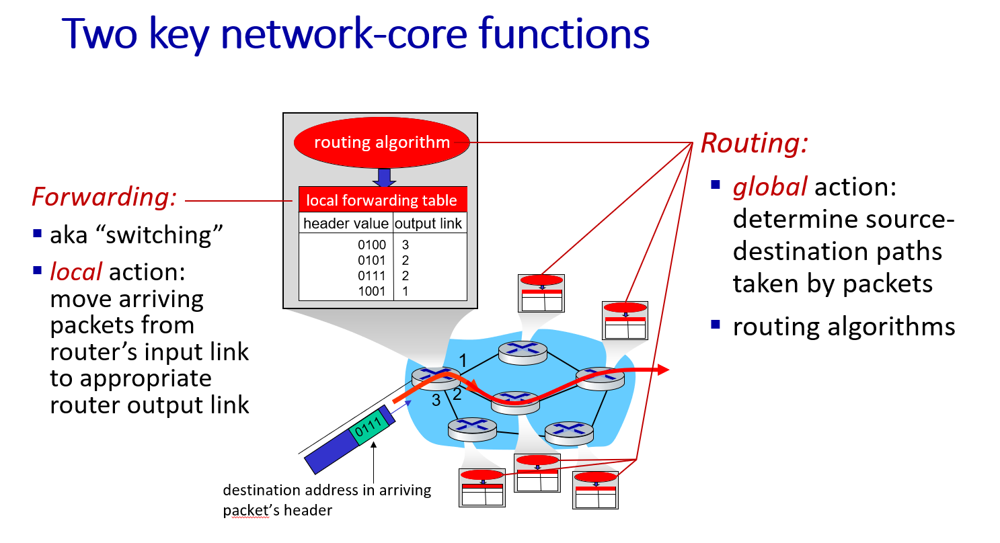

### Packet-switching: Store-and-Forward

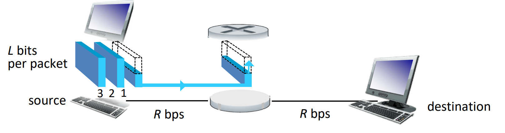

- **entire** packet must arrive at router before it can be transmitted on next link
- end-end delay = $2L/R$ (assuming zero propagation delay)

### Packet Switching: Queueing Delay, Loss

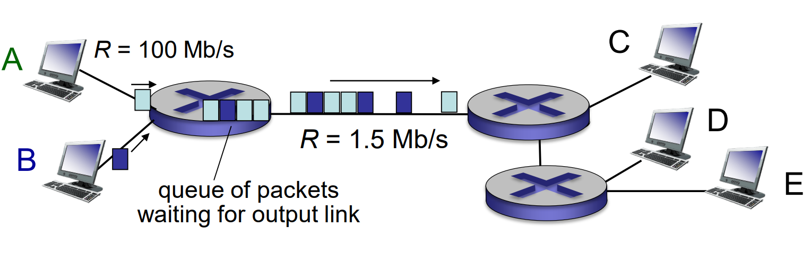

- if arrival rate > transmission rate,
  - packets will queue
  - packets can be dropped (lost) if memory (buffer) fills up

### Alternative core: Circuit Switching

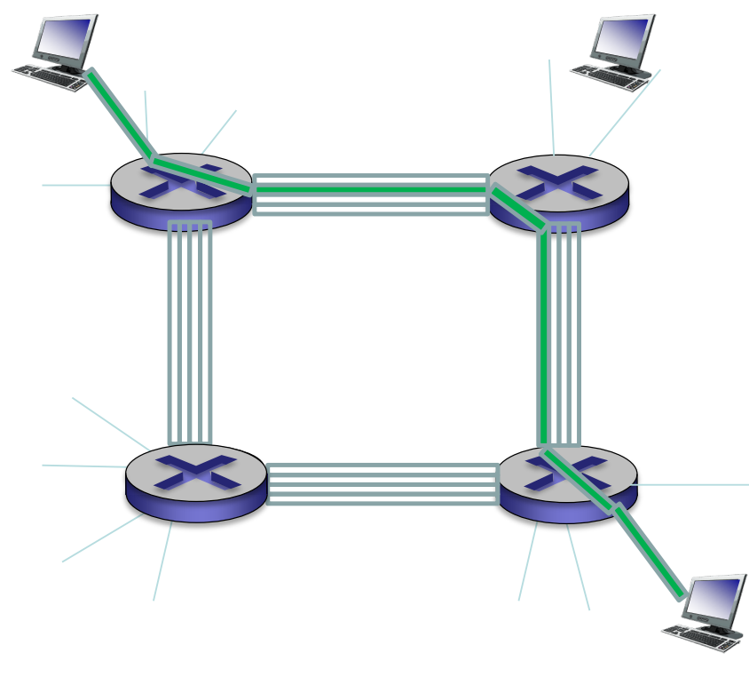

- FDM: Frequency Division Multiplexing
  - 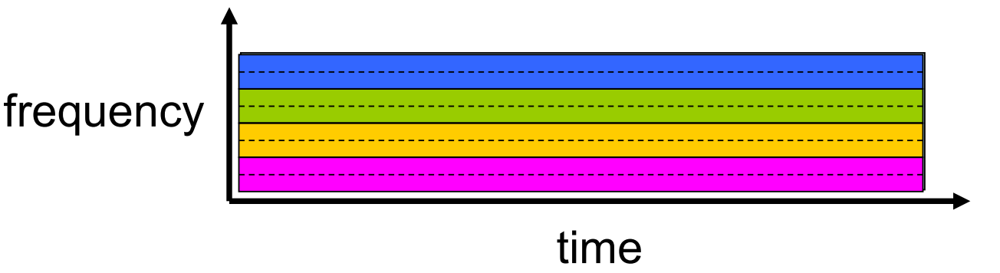{: w="30"}
- TDM: Time Division Multiplexing
  - 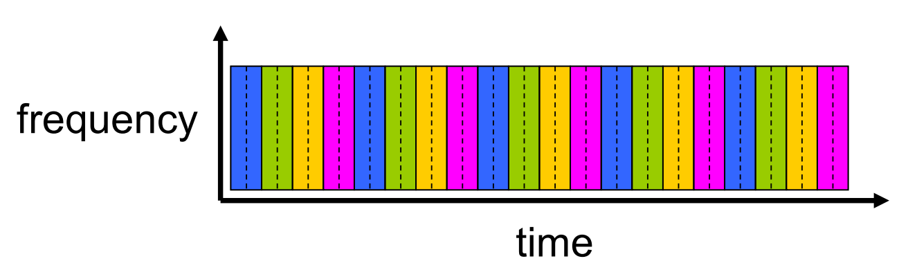{: w="30"}

### Internet Structure: Network of Networks

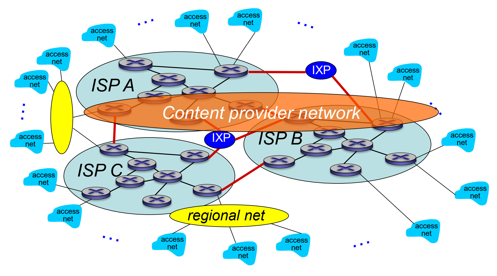

- IXP: Internet exchange point

## Delay, Loss, Throughput in networks

- packet arrival rate to link (temporarily) exceeds output link capacity
- packets queue, wait for turn

- packet being transmitted (**delay**)
- packets queueing (**delay**)
- free (available) buffers: arriving packets dropped (**loss**) if no free buffers

### Delay

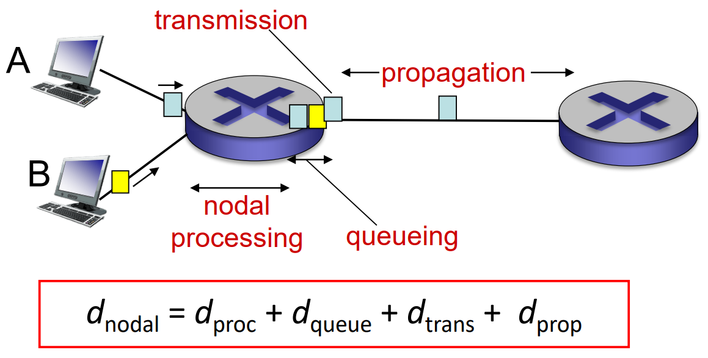

- $d_{\text{proc}}$ nodal processing delay < msec
  - check bit errors
  - determine output link
- $d_{\text{queue}}$ queueing delay
  - time waiting at output link for transmission
  - $R$: link bandwidth (bps)
  - $L$: packet length (bits)
  - $a$: average packet arrival rate
  - $La/R\to 0$: avg delay small
  - $La/R\to 1$: avg delay large
  - $La/R> 1$: avg delay infinite
- $d_{\text{trans}}$  transmission delay
  - **time to upload bits**
  - $L$: packet length (bits)
  - $R$: link bandwidth (bps)
  - $d_{\text{trans}} = L/R$
- $d_{\text{prop}}$ propagation delay:
  - **time to propagate bits from A to B**
  - $d$: length of physical link
  - $v$: propagation speed
  - $d_{\text{prop}} = d/v$

### Loss

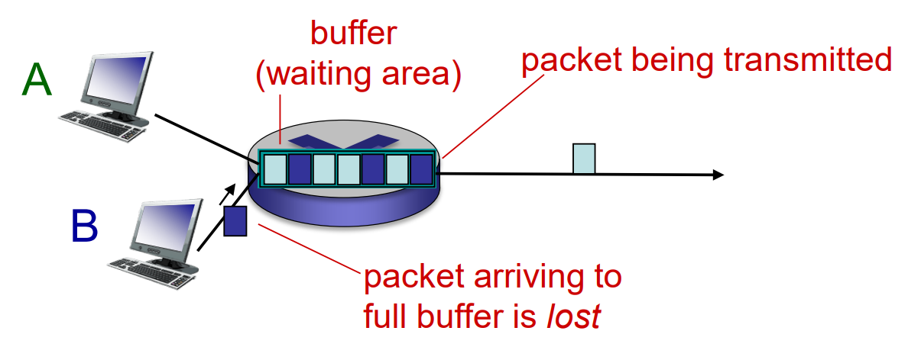

### Throughput

- throughput: rate (bits/time unit) at which bits transferred.
- bottleneck link: link on end-end path that constrains end-end throughput

---

## Internet protocol stack

|layer|use|
|---|---|
|application|supporting network applications (FTP, SMTP, HTTP)|
|transport|process-process data transfer (TCP, UDP)|
|network|routing of packets from source to destination (IP, routing protocols)|
|link|data transfer between neighboring network elements (Ethernet, 802.11 (WiFi), PPP)
|physical|bits on the wire|

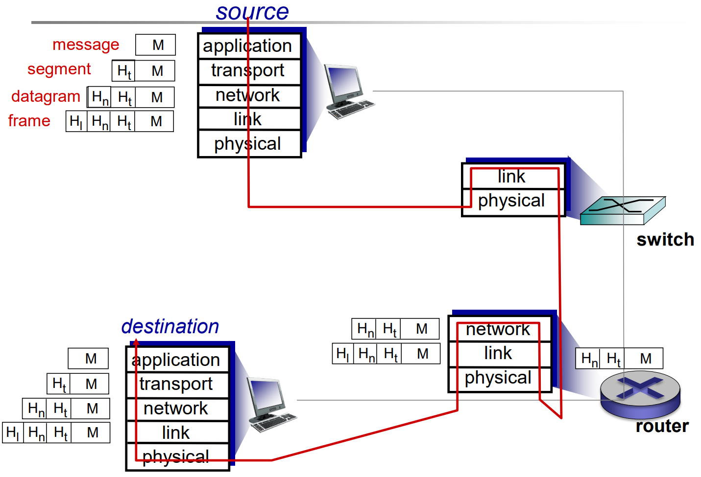

- Switch
  - level 2 device
  - connects devices on a computer network by using packet switching to receive and forward data to the destination device.
- Router
  - level 3 device
  - Routers perform the traffic directing functions between networks and on the global Internet.


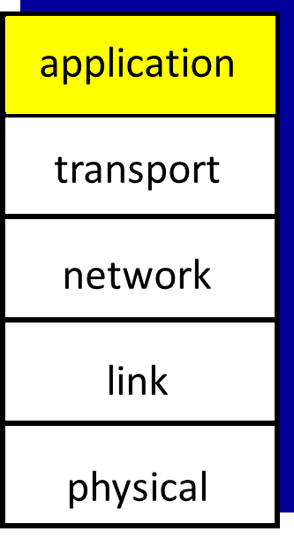{: w="8"}

## Application architectures

Possible structure of applications:

- Client-server
- Peer-to-peer (P2P)
- Hybrid

### Client-server architecture

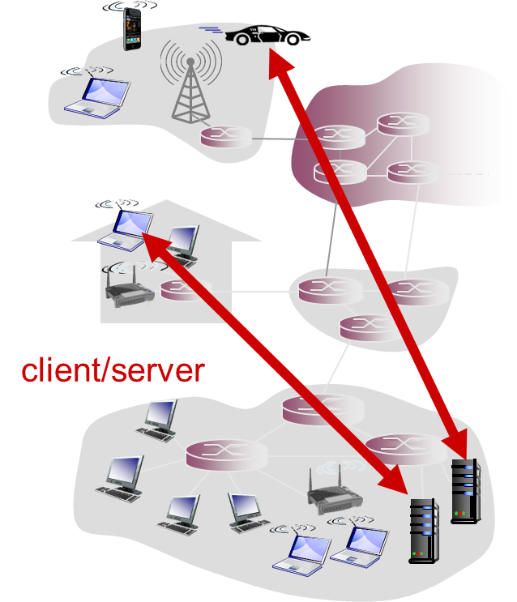

server

- always-on host
- permanent IP address

client

- may be intermittently connected
- may have dynamic IP addresses

### P2P architecture

- no always-on server
- peers request service from other peers, provide service in return to other peers
- self scalability – new peers bring new service capacity, as well as new service demands

### Hybrid of client-server and P2P

- Finding address of remote party: centralized server(s)
- Client-client connection is direct (not through server) 

## Processes communicating

- client process: process that initiates communication
- server process: process that waits to be contacted

## Sockets

- process sends/receives messages to/from its socket
- socket analogous to **mailbox**

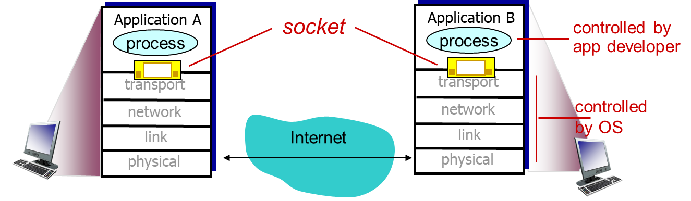

## Transport service requirements

| Application        | Data Loss    | Throughput                        | Time Sensitive        |
|--------------------|--------------|-----------------------------------|-----------------------|
| file transfer      | no loss      | elastic                           | no                    |
| e-mail             | no loss      | elastic                           | no                    |
| Web documents      | no loss      | elastic                           | no                    |
| real-time audio/video | loss-tolerant | audio: 5kbps-1Mbps              | yes, 100's msec       |
|                    |              | video:10kbps-5Mbps                | yes, few secs         |
| stored audio/video | loss-tolerant | same as above                    | yes, 100's ms         |
| interactive games  | loss-tolerant | few kbps up                       | yes and no            |
| text messaging     | no loss      | elastic                           | no                    |

---

## Internet transport protocols services

### TCP service

- reliable transport
- flow control
  - sender won’t overwhelm receiver
- congestion control
  - throttle sender when network overloaded
- does not provide
  - timing
  - minimum throughput guarantee
  - security
- connection-oriented

### UDP service

- unreliable data transfer between sending and receiving process
- does not provide
  - reliability
  - flow control
  - congestion control
  - timing
  - throughput guarantee
  - security
  - connection setup

### Applications & transport protocols

| Application            | Application Layer Protocol                            | Underlying Transport Protocol |
|------------------------|-------------------------------------------------------|-------------------------------|
| e-mail                 | SMTP [RFC 2821]                                       | TCP                           |
| remote terminal access | Telnet [RFC 854], SSH                                 | TCP                           |
| Web                    | HTTP [RFC 2616]                                       | TCP                           |
| file transfer          | FTP [RFC 959]                                         | TCP                           |
| streaming multimedia   | HTTP (e.g., YouTube), RTP [RFC 1889]                  | TCP or UDP                    |
| Internet telephony     | SIP, RTP, proprietary (e.g., Skype)                   | TCP or UDP                    |
| naming                 | DNS                                                   | UDP (and TCP)                 |

### Socket programming with UDP

- no handshaking
- sender explicitly attaches IP destination address and port # to each packet
- receiver extracts sender IP address and port# from received packet

### Socket programming with TCP

server must

- first be running
- have created socket (door) that welcomes client’s contact

client contacts server by:

- Creating TCP socket, specifying IP address, port number of server process

server TCP creates new socket

- for server process to communicate with that particular client

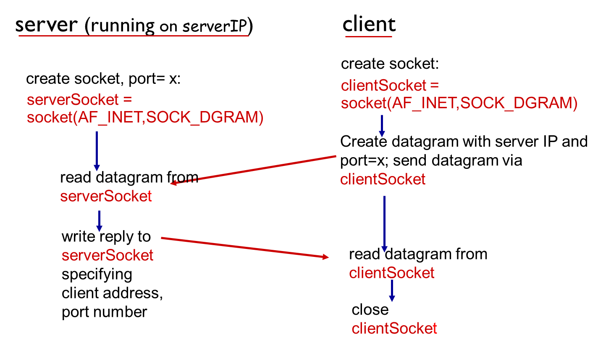{: w="700" }
_UDP_

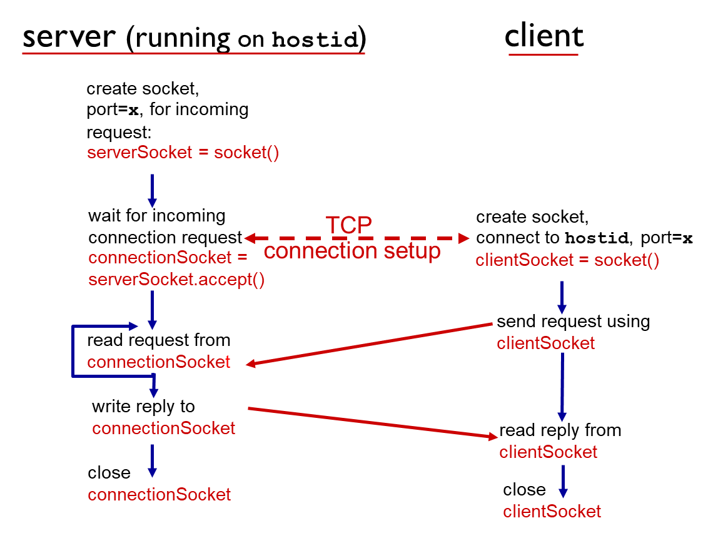{: w="700" }
_TCP_

---

## Web and HTTP (hypertext transfer protocol)

- each object is addressable by a URL:

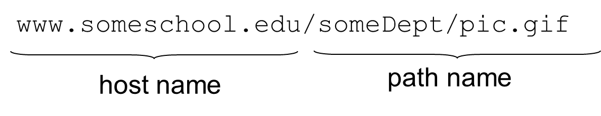{: w="500" }

- use TCP on port 80
- HTTP is stateless: server maintains no information about past client requests

### Non-persistent HTTP

RTT (Round Trip Time): time for a small packet to travel from client to server and back

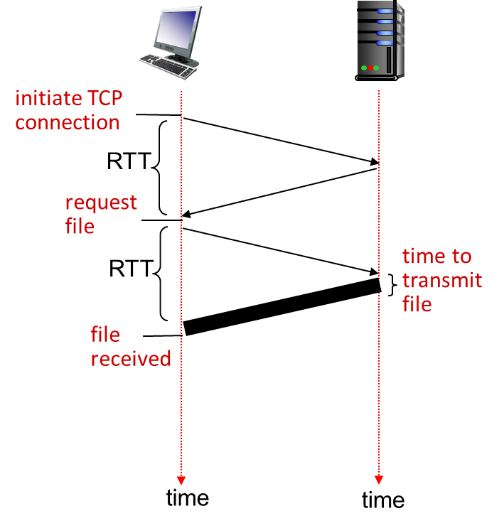{: w="300" }
_non-persistent HTTP response time = 2RTT+ file transmission time_

### Persistent HTTP

server leaves connection open after sending response

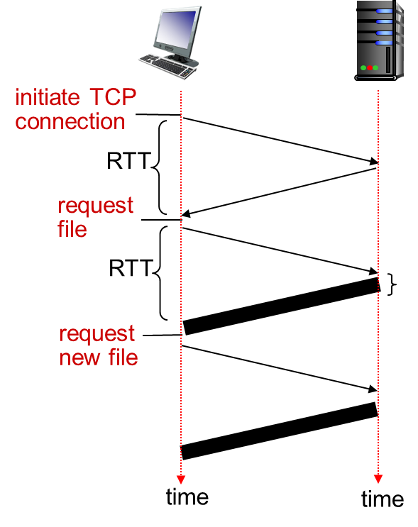{: h="700" }

<details markdown="1">
<summary>Other Optimizations</summary>

### Pipelining

Send several requests at once

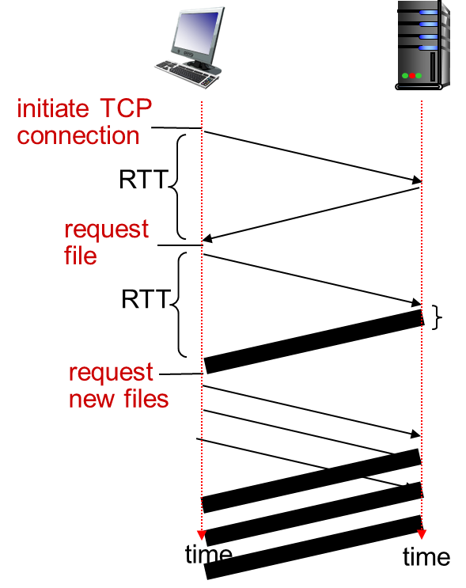{: w="700" }

### HTTP/2

Push resources (send file ahead that clients may request)

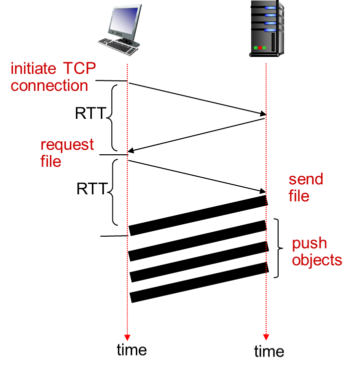{: w="700" }

### QUIC

Eliminate first RTT

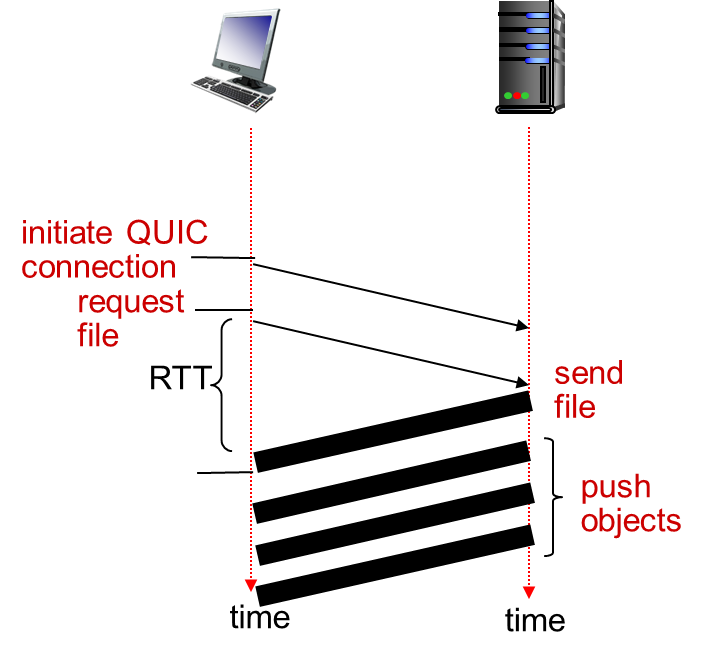{: w="700" }

</details>

### HTTP request message

two types of HTTP messages: **request**, **response**.

HTTP request message:

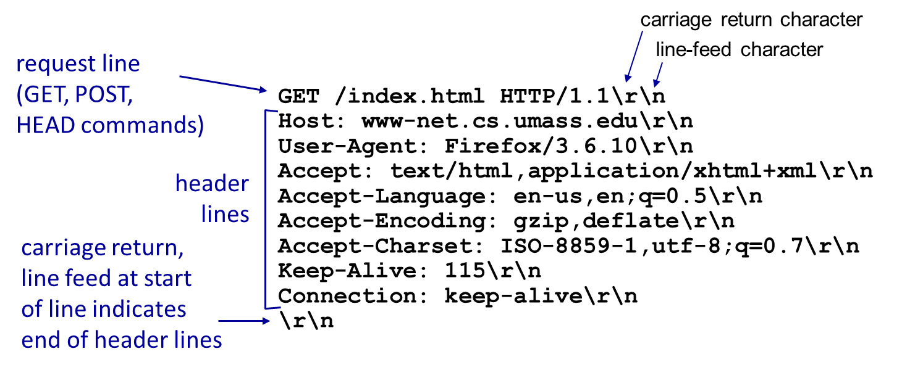{: w="600" }

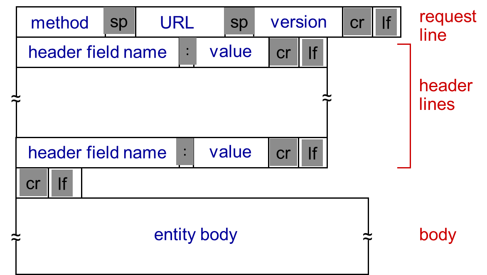{: w="600" }

- `GET` method: input is in `URL` field.
- `POST` method: inpit is in entity body.
- `HEAD` method: asks server to leave requested object out of response
- (HTTP1.1) `PUT` method: uploads file in entity body to path specified in URL field
- (HTTP1.1) `DELETE` method: deletes file specified in the URL field

### HTTP response message

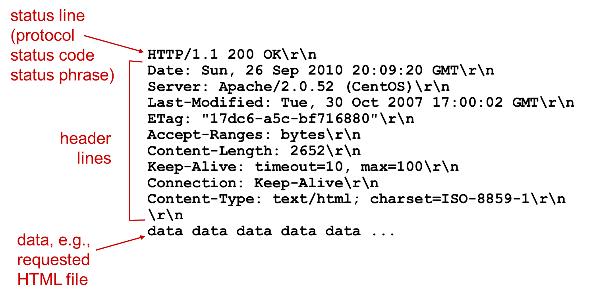{: w="700" }

code | message | meaning
---|---|---
200 | OK | request succeeded, | requested object later in this msg
301 | Moved Permanently | requested object moved, new location specified later in this msg (Location:)
400 | Bad Request | request msg not understood by server
404 | Not Found | requested document not found on this server
505 | HTTP Version Not Supported |

### User-server state: cookies

1) Cookie header line of HTTP **response** message
2) Cookie header line in next HTTP **request** message
3) Cookie file kept on user’s host, managed by user’s browser
4) Back-end database at Website

Server creats a unique ID as cookies and a entry in back-end database. Cookies can be used for:

- authorization
- shopping carts
- recommendations
- user session state (Web e-mail)
- 
---


## Web caches (proxy server)

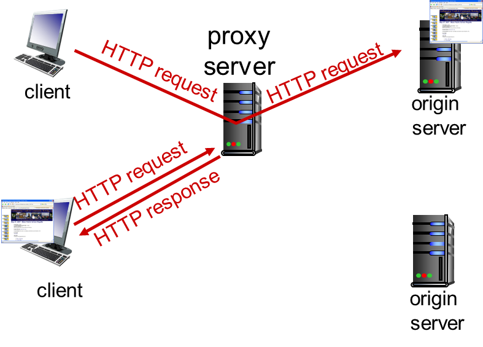{: w="500" }

1) browser sends all HTTP requests to cache
2) object in cache: cache returns object
3) else cache requests object from origin server, then returns object to client

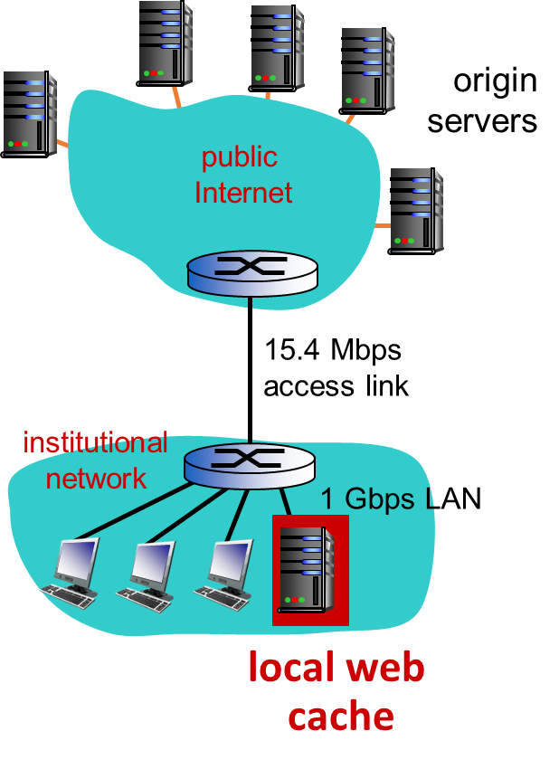{: w="400" }

### Conditional GET

1) send HTTP request with `If-modified-since: <date>`
2) server response `HTTP/1.0 304 Not Modified` if data not modified ever since
3) server response `HTTP/1.0 200 OK <data>` otherwise

---

# Chapter 2

## Electronic mail

major components:

- user agents
- mail servers
- SMTP: Simple Mail Transfer Protocol

### Electronic Mail: SMTP [RFC 2821]

**SMTP: protocol for exchanging email messages**

- use TCP, port 25
- direct transfer
- three phases of transfer
  - handshaking (greeting)
  - transfer of messages
  - closure
- command/response interaction like HTTP
  - commands: ASCII text (7-bit)
  - response: status code and phrase

<details markdown="1">
<summary>Sample SMTP interaction</summary>

```
S: 220 hamburger.edu 
C: HELO crepes.fr 
S: 250  Hello crepes.fr, pleased to meet you 
C: MAIL FROM: <alice@crepes.fr> 
S: 250 alice@crepes.fr... Sender ok 
C: RCPT TO: <bob@hamburger.edu> 
S: 250 bob@hamburger.edu ... Recipient ok 
C: DATA 
S: 354 Enter mail, end with "." on a line by itself 
C: Do you like ketchup? 
C: How about pickles? 
C: . 
S: 250 Message accepted for delivery 
C: QUIT 
S: 221 hamburger.edu closing connection
```

(end with **CRLF.CRLF**)

</details>

### Mail message format

**RFC 822: standard for text message format**

- header lines, e.g.,
To:
From:
Subject:
(different from SMTP MAIL FROM)
- Body: the “message” (ASCII characters only)

### Mail access protocols

{: w="700" }

**mail access protocol: retrieval from server**

protocol|description
--|---
POP| Post Office Protocol [RFC 1939]: authorization, download
IMAP| Internet Mail Access Protocol [RFC 1730]: more features, including manipulation of stored messages on server
HTTP| gmail, Hotmail, Yahoo! Mail, etc.

## DNS: domain name system

Domain Name System:

- **distributed** database (in hierarchy of **name servers**)
- **application-layer protocol**: hosts, name servers communicate to resolve names (address/name translation)

steps:

- client wants IP for `www.amazon.com`; 1st approximation:
- client queries root server to find com DNS server
- client queries `.com` DNS server to get `amazon.com` DNS server
- client queries `amazon.com` DNS server to get  IP address for `www.amazon.com`

### DNS name servers

Top-level domain (TLD) servers:

- `com`, `org`, `net`, `edu`, ...
- top-level country domains: `uk`, `fr`, ...

Authoritative DNS servers:

- organization’s named hosts
- maintained by organization or service provider

Local DNS name server (cached)

- does not strictly belong to hierarchy
- each ISP has one

### DNS name resolution example

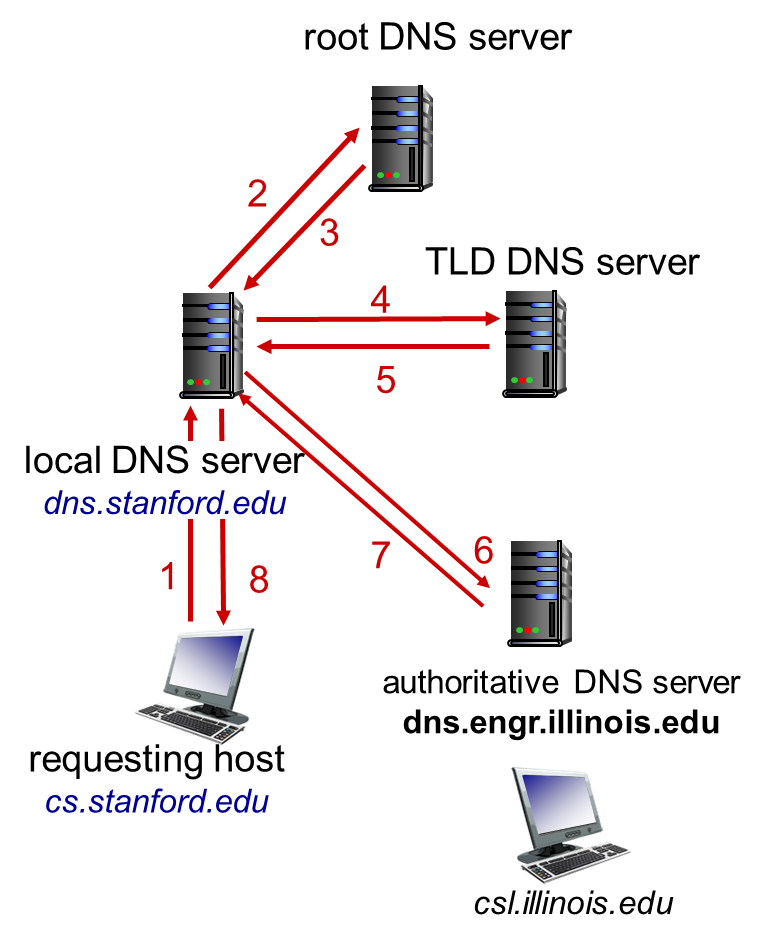{: w="500" }
_Diterated query_

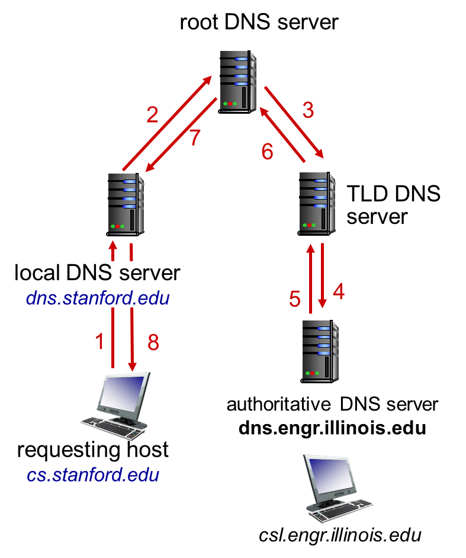
_recursive query_

Name server caches mappings untiel expired (time of **TTL**)

### DNS records

Distributed database storing **resource records** (RR).

RR Format: `(name, value, type, ttl)`

type|name|value|
---|---|---
A|hostname|IP address
NS|domain|hostname of authoritative name server for this domain
CNAME|alias name|is canonical(real) name
MX|hostname|mail server

### DNS protocol

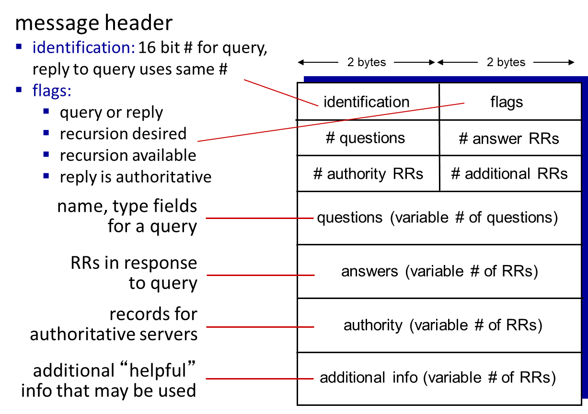{: w="700" }

---

## Pure P2P architecture

- no always-on server
- arbitrary end systems directly communicate
- peers are intermittently connected and change IP addresses

### File distribution: client-server vs P2P

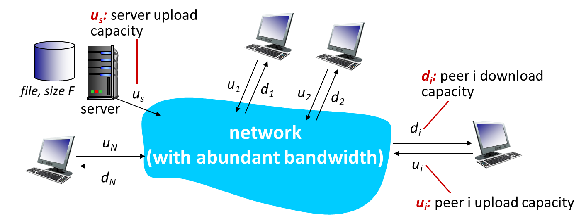{: w="600" }
_client-server model_

Time to distribute $F$ to $N$ clients using client-server approach

$$
D_{c-s} \geq \max \left\{N F / u_s, F / d_{\min }\right\}
$$

Time to  distribute $F$ to $N$ clients using P2P approach

$$
D_{P 2 P} \geq \max \left\{F / u_s, F / d_{\min }, N F /\left(u_s+\sum u_i\right)\right\}
$$

### P2P file distribution: BitTorrent

- File divided into 256Kb chunks
- Peers in torrent send/receive file chunks

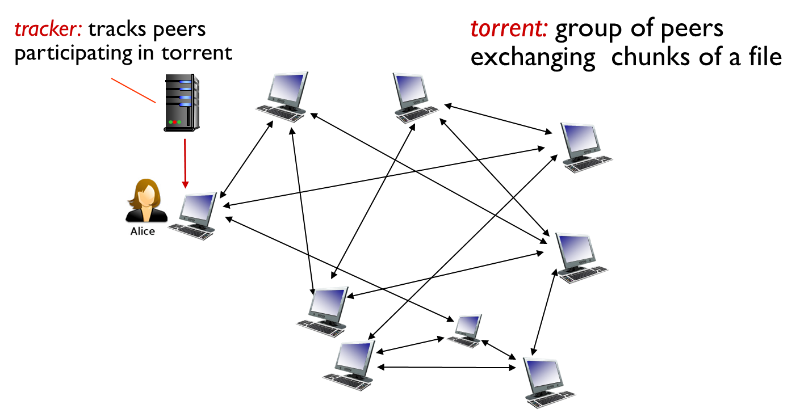{: w="600" }

peer joining torrent:

- has no chunks, accumulate them over time from other peers.
- registers with tracker to get list of peers, connects to **subset of peers** (“neighbors”)

requesting chunks:

- different peers have different subsets of file chunks
- periodically, asks each peer for list of chunks that they have
- requests missing chunks from peers, rarest first

sending chunks: tit-for-tat

- sends chunks to those four peers currently sending her chunks at highest rate
  - re-evaluate top 4 every 10 secs
  - other peers are choked by Alice (do not receive chunks from her)
- every 30 secs: randomly select another peer, starts sending chunks
  - newly chosen peer may join top 4 (and unchoke them)

## Distributed Hash Table (DHT)

Compared to simple Database, use Hash Table: `key` = hash(`original key`)

Original|Key|Key Value
--|--|--
John Washington|8962458|132-54-3570
Diana Louise Jones|7800356|761-55-3791
...|...|...

- Evenly distribute `(key, value)` over pairs
- Any peer can query database with a key
- Each peer only knows about a small number of other peers
- small number of messages exchanged among peers

### Assign key-value pairs to peers

rule: assign key-value pair to the peer that has the closest ID (**the immediate successor**).

> e.g., ID space $\{0,1,2,3,…,63\}$
> suppose 8 peers: $1, 12, 13, 25, 32, 40, 48, 60$
>
> - If key = 51, then assigned to peer 60
> - If key = 60, then assigned to peer 60
> - If key = 61, then assigned to peer 1
{: .prompt-tip }

### Silly Strawman Circular DHT

each peer only aware of immediate successor and predecessor.

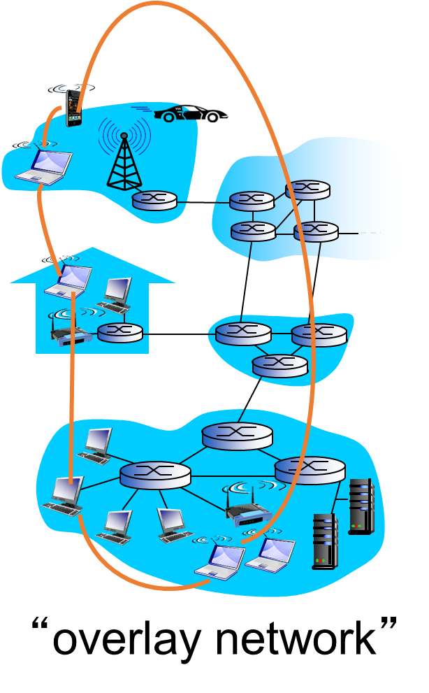{: w="400" }

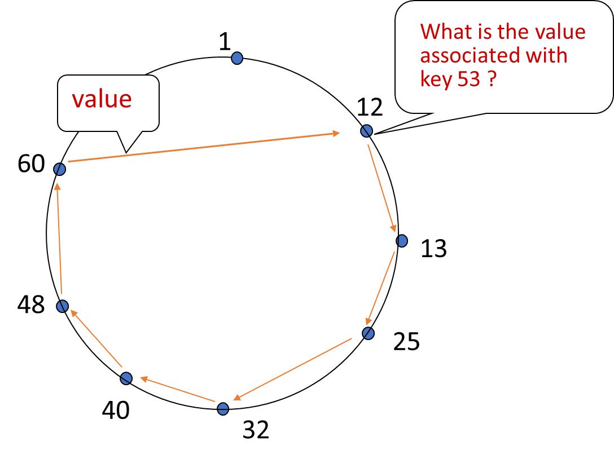{: w="500" }
_$O(N)$_

### Circular DHT with shortcuts (Chord)

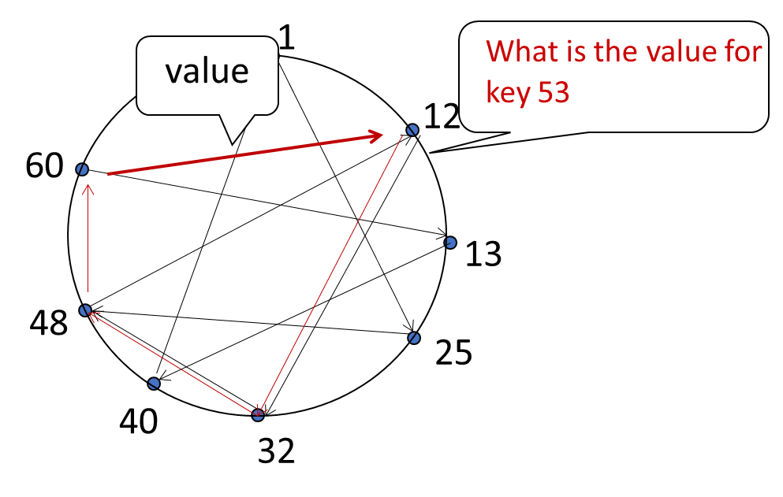{: w="500" }
_$O(\log N)$_

### Peer churn

- peers may come and go (churn)
- each peer knows address of its two successors
- each peer periodically pings its two successors to check aliveness
- if immediate uccessor leaves, choose next successor as new immediate successor
- and ask for the successors of its new immediate successor

## Video Streaming and CDNs

- CBR: (constant bit rate): video encoding rate fixed
- VBR:  (variable bit rate): video encoding rate changes as amount of spatial, temporal coding changes
- examples:
  - MPEG 1 (CD-ROM) 1.5 Mbps
  - MPEG2 (DVD) 3-6 Mbps
  - MPEG4 (often used in Internet, < 1 Mbps)

### Streaming multimedia: DASH

DASH: Dynamic, Adaptive Streaming over HTTP

- divides video file into multiple chunks
- each chunk stored, encoded at different rates
- manifest file: provides URLs for different chunks
- client requests chunks according to server-to-client bandwidth.

### Content distribution networks (CDN)

- To stream content to hundreds of thousands of simultaneous users.
- Store/serve multiple copies of videos at multiple geographically distributed sites (CDN)

{: w="600" }

---


# Chapter 3: Transport Layer

## Transport services and protocols

- transport protocols run in end systems
- send side: breaks app messages into segments, passes to  network layer
- rcv side: reassembles segments into messages, passes to app layer
- TCP / UDP

TCP and UDP:

- TCP: reliable, in-order delivery
- UDP: unreliable, unordered delivery

**Transport** vs. **Network Layer**

- network layer: logical communication between hosts
- transport layer: logical communication between processes

## Multiplexing/Demultiplexing

- multiplexing at sender
- demultiplexing at receiver

host uses **IP addresses & port** numbers to direct segment to appropriate socket

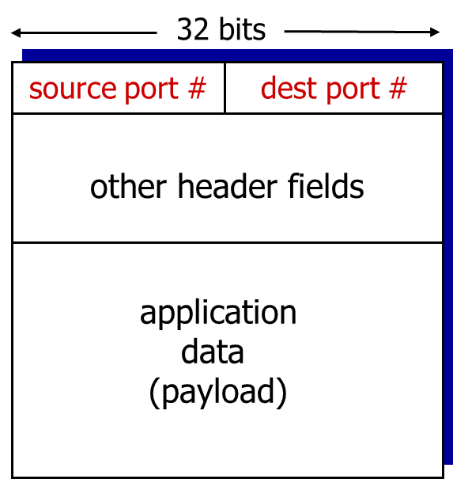{: w="400" }
_TCP/UDP segment format_

### In Connectionless Demultiplexing (UDP)

In **UDP**, IP datagrams with same dest. port #, but **different** source IP addresses and/or source port numbers will be directed to **same socket** at dest.

### In Connection-Oriented Demux (TCP)

TCP socket identified by 4-tuple:

- source IP address
- source port number
- dest IP address
- dest port number

demux: receiver uses **all four values** to direct segment to appropriate socket

- server have different sockets for each connecting client
- non-persistent HTTP will have different socket for each request

## UDP: User Datagram Protocol [RFC 768]

- UDP segments may be: lost or delivered out-of-order to app
- connectionless
  - no handshaking between UDP sender, receiver
  - each UDP segment handled independently of others
- used in
  - streaming multimedia apps (loss tolerant, rate sensitive)
  - DNS
  - SNMP
  
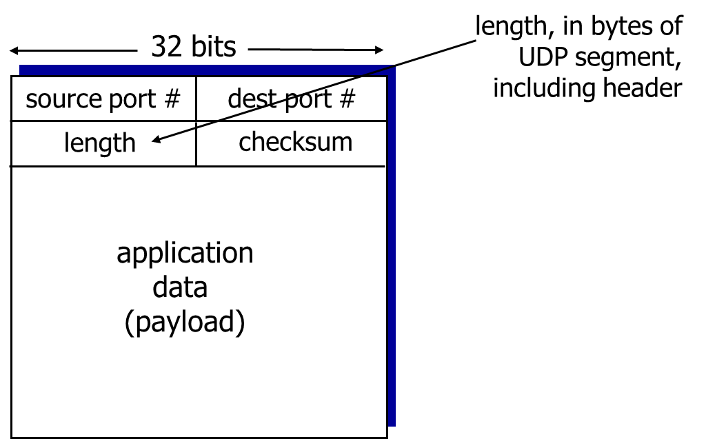{: w="400" }
_UDP segment format_

checksum is used to detect errors.

---

# Reliable Data Transfer: Intuition

rdt
: reliable data transfer protocol

udt
: unreliable data transfer protocol

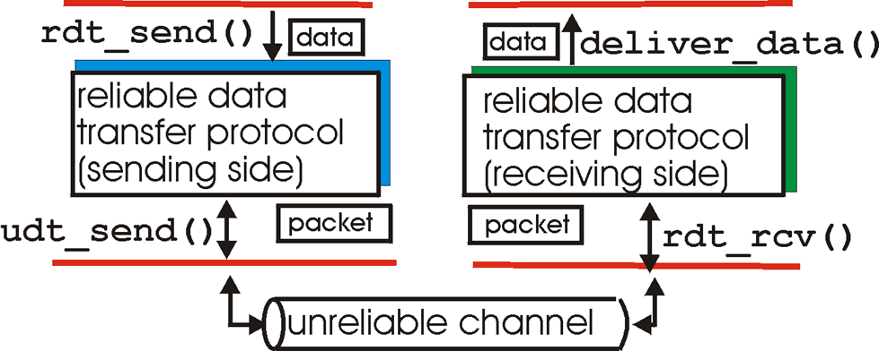{: w="500" }

## Reliable Channel

channel is perfectly reliable:

- no bit errors
- no loss of packets

## Channel with Bit Errors

- underlying channel may flip bits in packet

Detect error: checksum

Recover from errors: receiver tells sender with:

ACK
: acknowledgements

NAKs
:negative acknowledgements

### if ACK/NAK corrupted

- sender doesn’t know what happened at receiver
- can’t just retransmit: possible duplicate
- sender adds **sequence number** to each pkt to deal with duplicating

FSM

{: w="600" }

> Notice that the 2 sequence numbers (0 and 1) suffies
{: .prompt-tip }

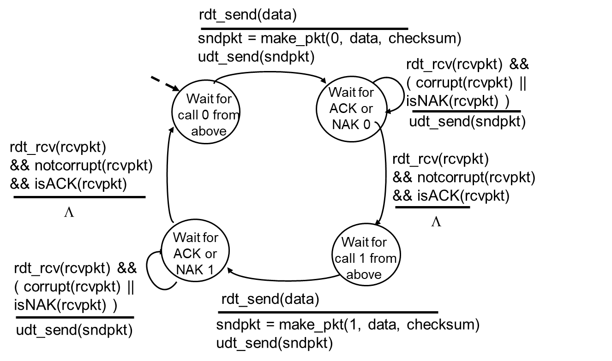{: w="600" }

## NAK-free protocol

- using ACKs only
- instead of NAK, receiver sends ACK for last pkt received OK
- in sender, duplicate ACK means NAK

## Channels with Errors and Loss

- Channel can also lose packets (data, ACKs)
- sender waits “reasonable” amount of time for ACK
- retransmits if no ACK received in this time

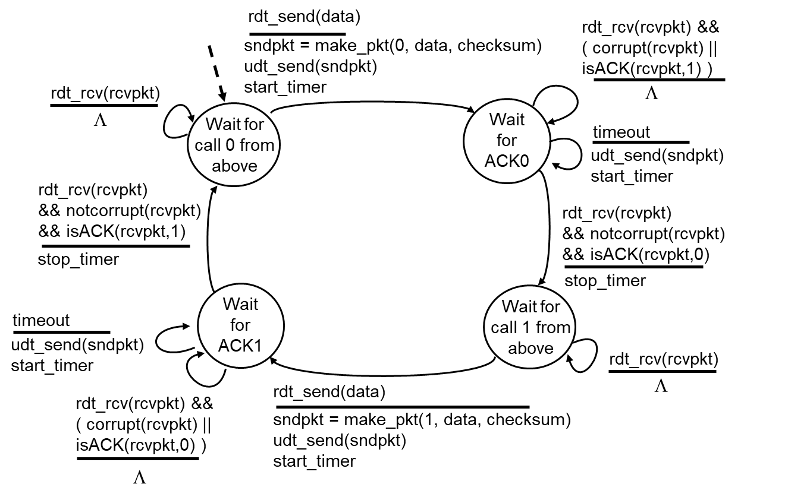{: w="700" }

### Performance

utilization $U_{\text {sender }}$ (1 Gbps link, 15 ms prop. delay, 8000 bit packet)

$$
U_{\text {sender }}=\frac{L / R}{R T+L / R}=\frac{.008}{30.008}=0.00027
$$

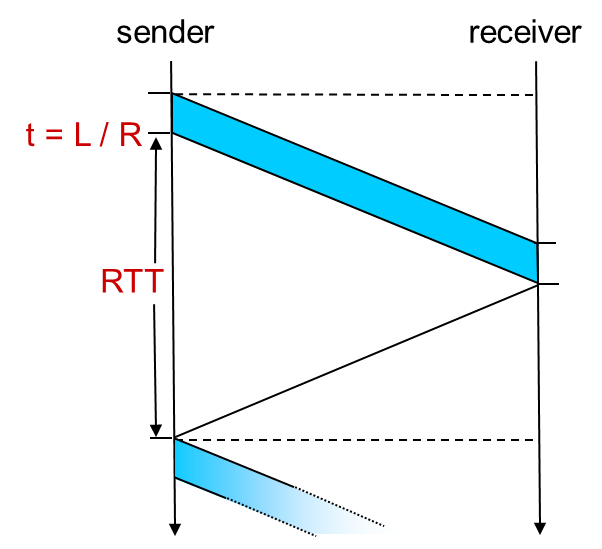{: w="300" }

## Pipelining

e.g. $3\times U_{\text {sender }}$

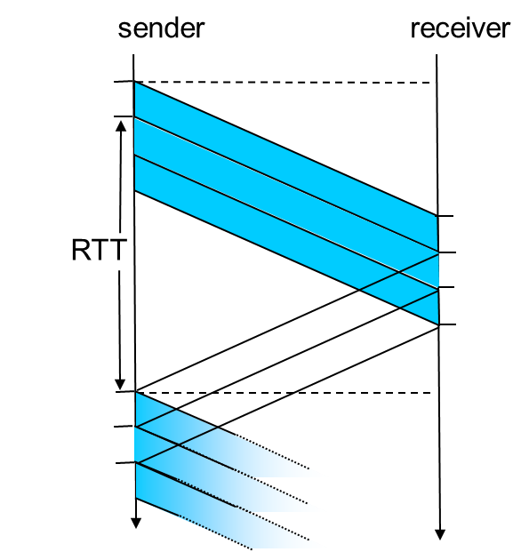{: w="300" }

### Go-back-N

- sender can have up to N unacked packets in pipeline
- receiver only sends **cumulative** ack, Doesn’t ack packet if there’s a gap
- sender has timer for oldest unacked packet
- when timer expires, retransmit all unacked packets

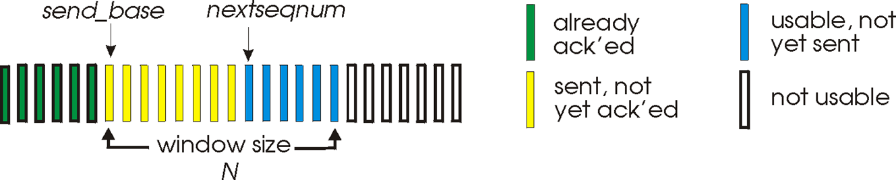{: w="600" }

<!-- 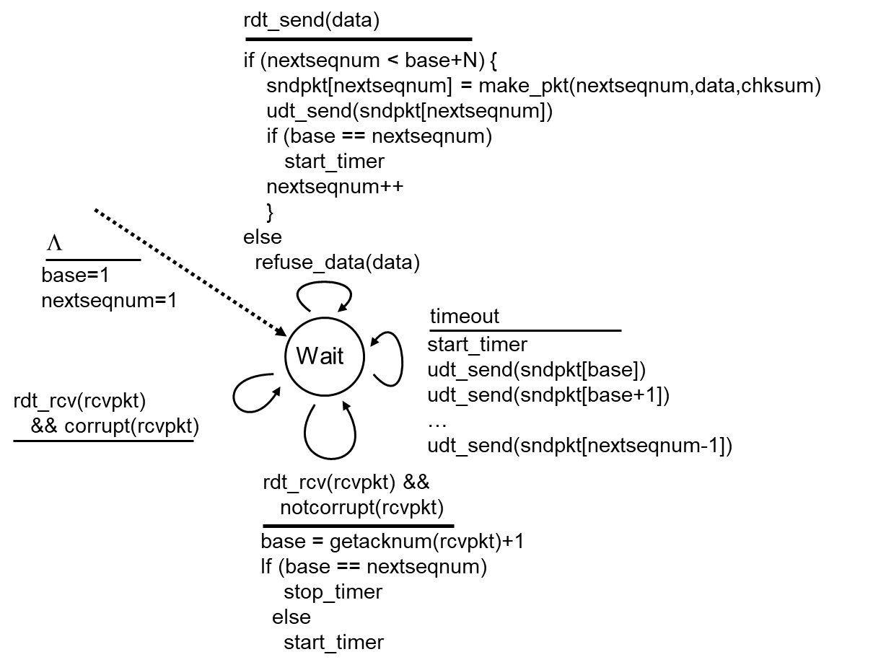{: w="700" } -->

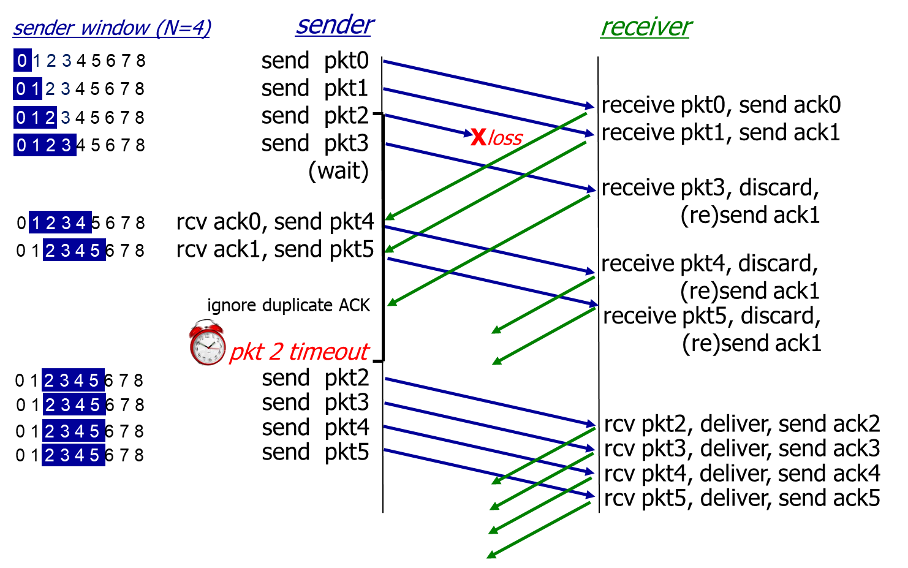{: w="800" }

### Selective Repeat

- sender can have up to N unacked packets in pipeline
- rcvr sends individual ack for each packet
- sender maintains timer for each unacked packet
- when timer expires, retransmit only that unacked packet

# Reliable Data Transfer: Intuition

## Selective Repeat

- receiver individually acknowledges all correctly received pkts
- sender only resends pkts for which ACK not received
- sender window

<!-- 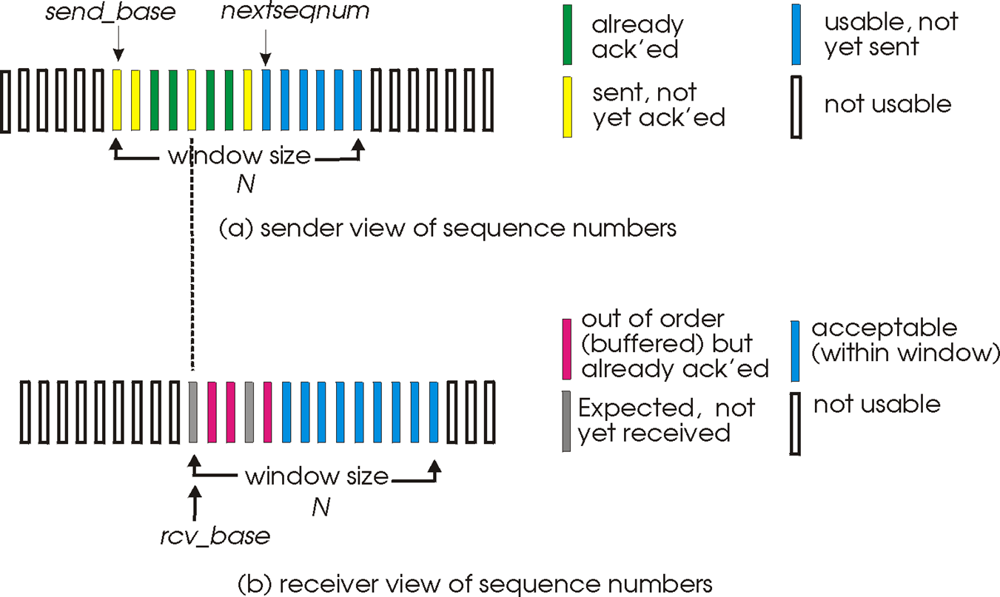{: w="700" } -->

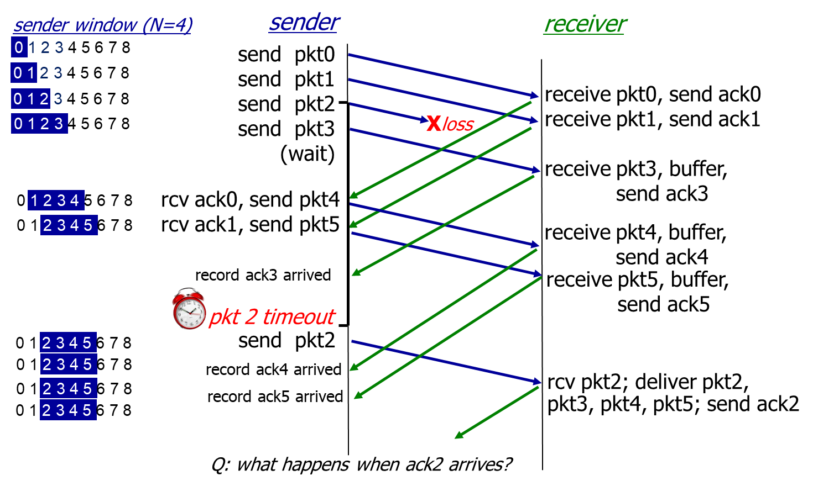{: w="800" }

### Selective repeat: dilemma

Receiver can’t see sender side. Assume using Seq. No. 0, 1, 2, 3.

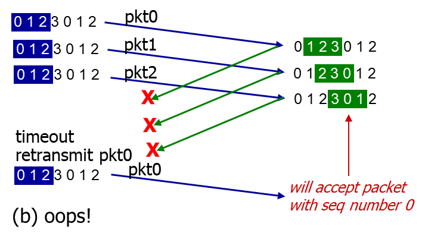{: w="400" }

# TCP

point-to-point
: one sender, one receiver

reliable, in-order byte steam
: no “message boundaries”

pipelined
: TCP congestion and flow control set window size

full duplex data
: bi-directional data flow in same connection
: MSS (maximum segment size)

connection-oriented
: handshaking (exchange of control msgs) inits sender, receiver state before data exchange

flow controlled:
: sender will not overwhelm receiver

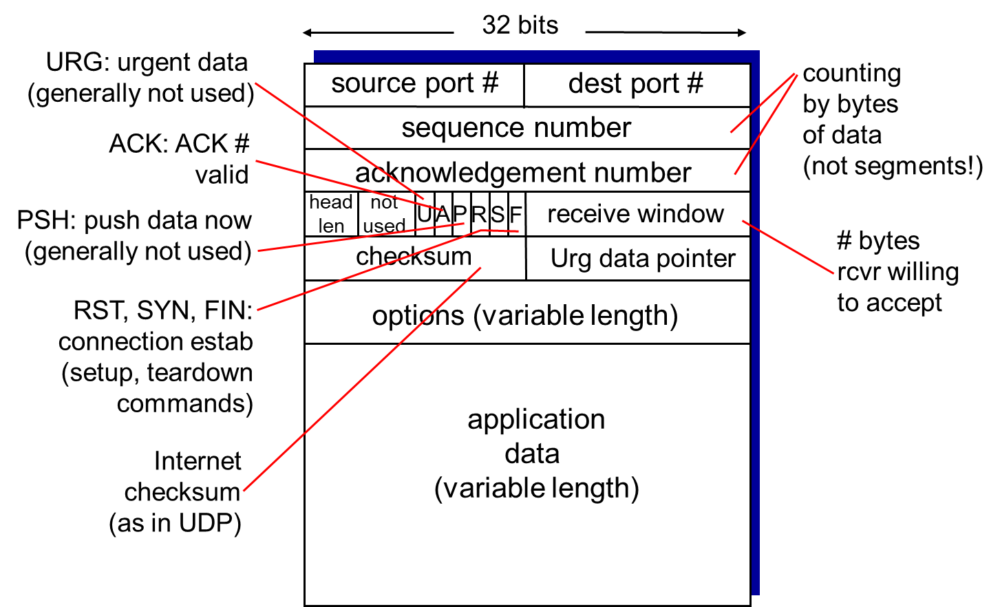{: w="700" }

## Sequence number & ACK number

sequence numbers
: byte stream “number” of first byte in segment’s data

acknowledgements
: seq # of next byte expected from the other side
: cumulative ACK

Sequence numbers acknowledgements are 32-bits unsigned integers.

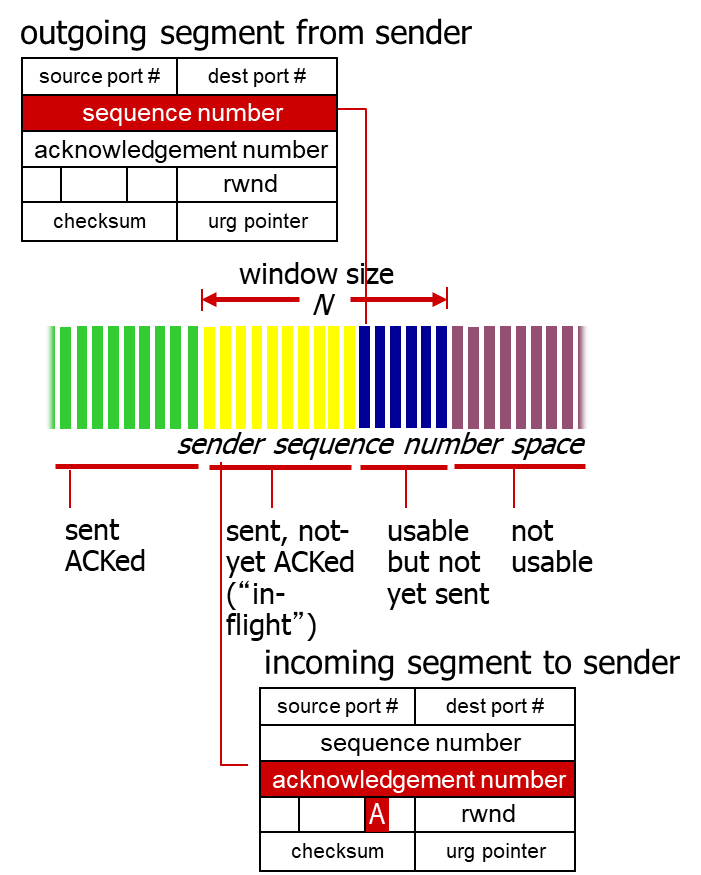{: w="500" }

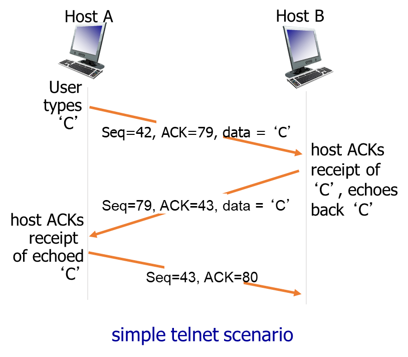

1. A sends 'C', which is the 42-th byte sent.
2. A has recieved the 78-th byte from B and expecting the 79-th.
3. B sends 'C', which is the 79-th byte sent
4. B has recieved the 42-th byte from B and expecting the 43-th.

## Tcp round Trip Time, Timeout

### RTT

SampleRTT
: measured time from segment transmission until ACK receipt

EstimatedRTT

$$
\text { EstimatedRTT }=(1-\alpha) \times \text { EstimatedRTT }+\alpha \times \text { SampleRTT }
$$

typical value: $\alpha = 0.125$

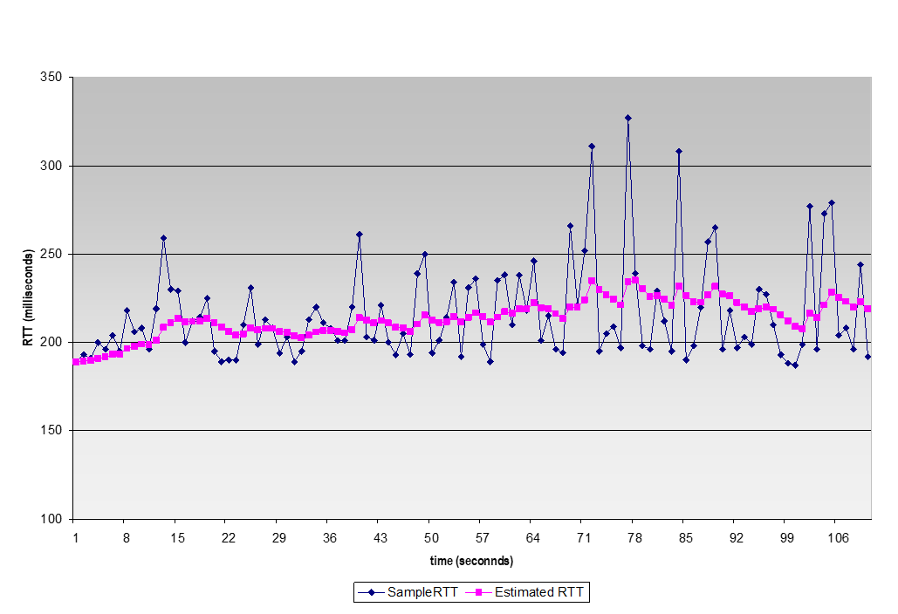{: w="500" }

### Timeout

Timeout Interval
: EstimatedRTT plus “safety margin”
: larger variation $\to$ larger safety margin

Deviation in RTT:

$$
\text { DevRTT }=(1-\beta) \times \text { DevRTT }+\beta \times \vert \text { SampleRTT }=\text { EstimatedRTT } \vert
$$

Typeical $\beta = 0.25$

$$
\text { TimeoutInterval }=\text { EstimatedRTT }+4 \times \text { DevRTT }
$$
---

## TCP reliable data transfer

### TCP ACK generation

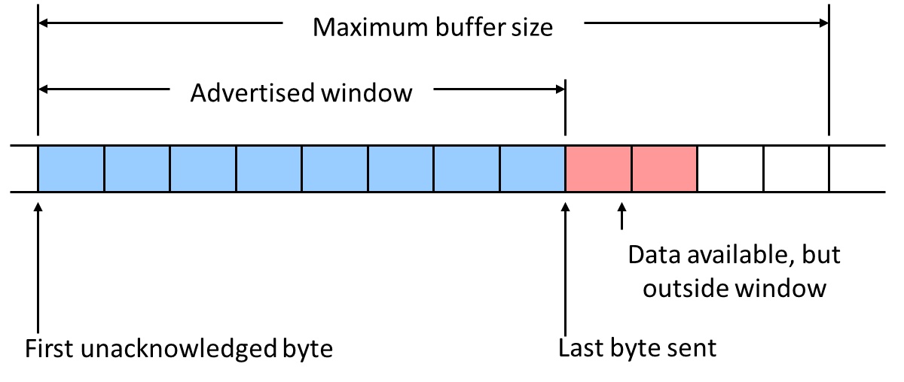{: w="400" }

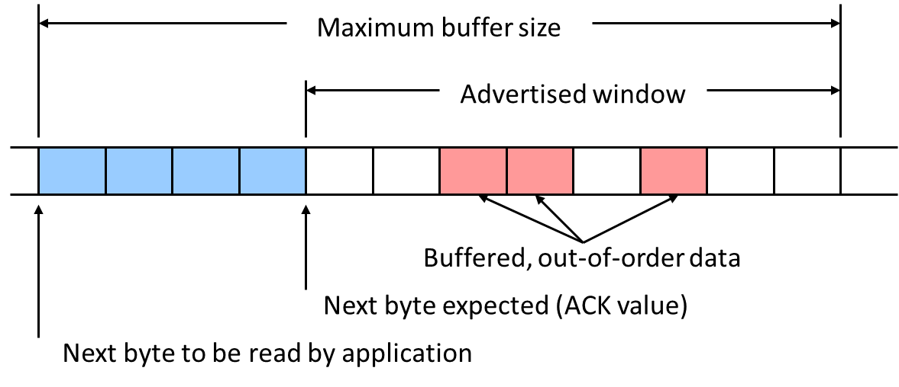{: w="400" }

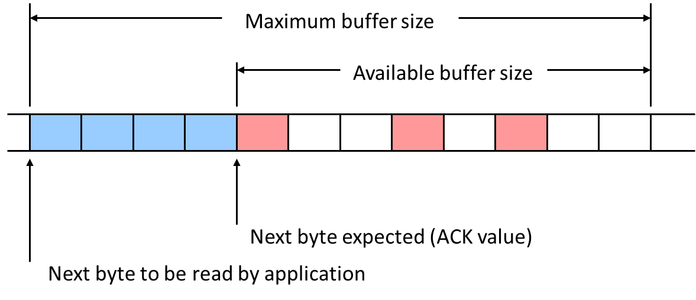{: w="400" }

Arrival of in-order segment with expected seq #. One other segment has ACK pending | Immediately send single **cumulative** ACK, ACKing both in-order segments
Arrival of out-of-order segment higher-than-expect seq. #. Gap detected. | Immediately send **duplicate** ACK, indicating seq. # of next expected byte
Arrival of segment that partially or completely fills gap.|Immediate send ACK, provided that segment starts at lower end of gap
  
### TCP fast retransmit

TCP fast retransmit
: if sender receives 3 ACKs for same data (“triple duplicate ACKs”), resend unacked segment with smallest seq #
: likely that unacked segment lost, so don’t wait for timeout

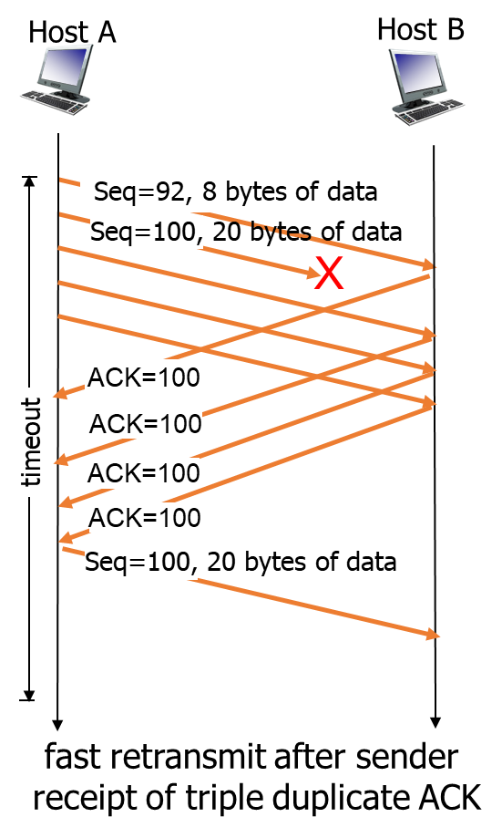{: w="300" }

## TCP flow control

flow control
: receiver controls sender, so sender won’t overflow receiver’s buffer by transmitting too much, too fast

- receiver “advertises” free buffer space by including rwnd value in TCP header of receiver-to-sender segments
- sender limits amount of unacked (“in-flight”) data to receiver’s rwnd value
- guarantees receive buffer will not overflow

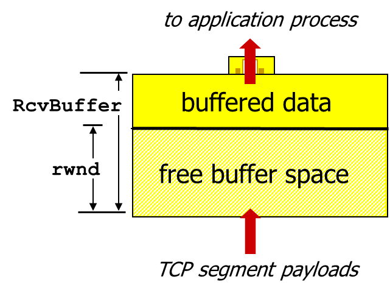{: w="300" }

## Connection Management

before exchanging data, sender/receiver “handshake”:

- agree to establish connection (each knowing the other willing to establish connection)
- agree on connection parameters

### TCP 3-way handshake

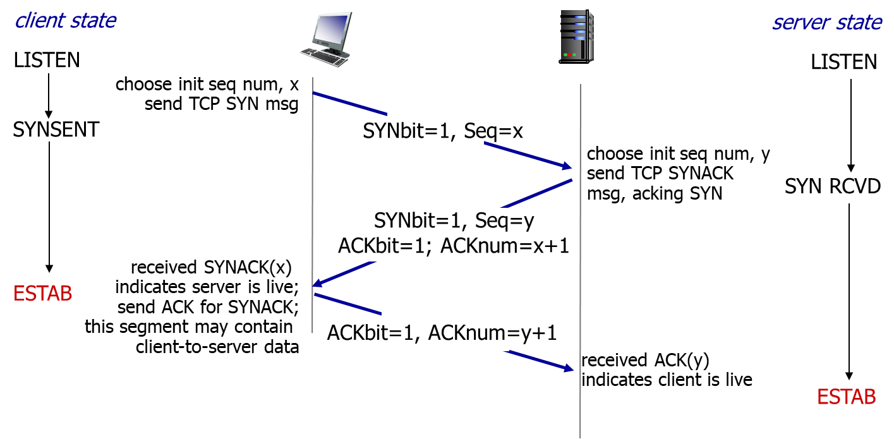{: w="700" }

### TCP closing a connection

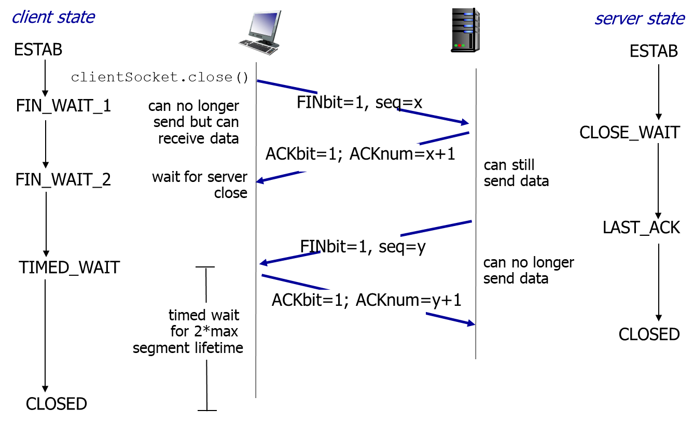{: w="700" }

---


## TCP reliable data transfer

### TCP ACK generation

{: w="400" }

{: w="400" }

{: w="400" }

Arrival of in-order segment with expected seq #. One other segment has ACK pending | Immediately send single **cumulative** ACK, ACKing both in-order segments
Arrival of out-of-order segment higher-than-expect seq. #. Gap detected. | Immediately send **duplicate** ACK, indicating seq. # of next expected byte
Arrival of segment that partially or completely fills gap.|Immediate send ACK, provided that segment starts at lower end of gap
  
### TCP fast retransmit

TCP fast retransmit
: if sender receives 3 ACKs for same data (“triple duplicate ACKs”), resend unacked segment with smallest seq #
: likely that unacked segment lost, so don’t wait for timeout

{: w="300" }

## TCP flow control

flow control
: receiver controls sender, so sender won’t overflow receiver’s buffer by transmitting too much, too fast

- receiver “advertises” free buffer space by including rwnd value in TCP header of receiver-to-sender segments
- sender limits amount of unacked (“in-flight”) data to receiver’s rwnd value
- guarantees receive buffer will not overflow

{: w="300" }

## Connection Management

before exchanging data, sender/receiver “handshake”:

- agree to establish connection (each knowing the other willing to establish connection)
- agree on connection parameters

### TCP 3-way handshake

{: w="700" }

### TCP closing a connection

{: w="700" }

## Congestion Control

### Principles of congestion control

congestion
: “too many sources sending too much data too fast for network to handle”
: lost packets (buffer overflow at routers)

- congestion control: for network
- flow control: for reciever

#### one router, **infinite** buffers

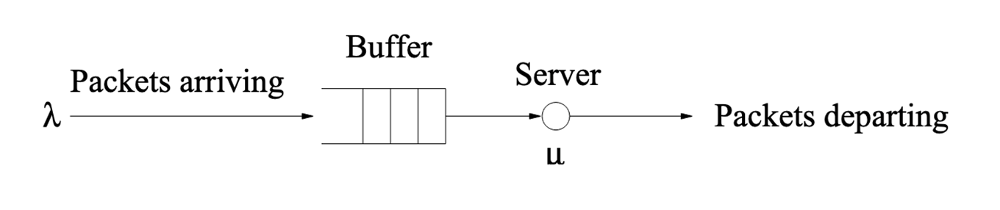{: w="600" }

$$
T=\frac{1}{\mu-\lambda}
$$

#### one router, **finite** buffers

> TODO

### TCP Congestion Control: CWND

cwnd
: congestion window
: dynamic, function of perceived network congestion

LastByteSent - LastByteAcked $\le$ cwnd

$$
\text { rate } \approx \frac{\text { cwnd }}{\mathrm{RTT}} \text { bytes/sec }
$$


### TCP Slow Start 

