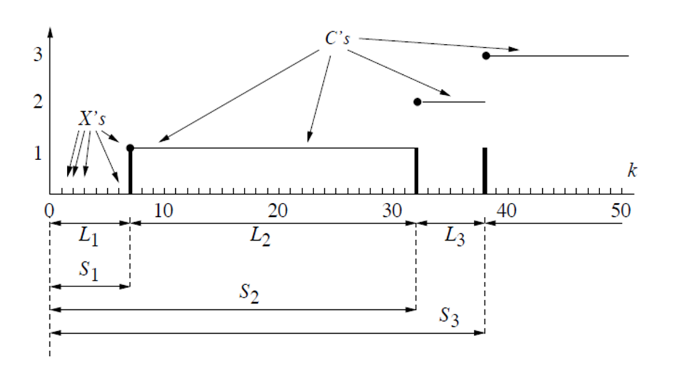

De morgan

$$
A^c\cap B^c = (A\cup B)^c
$$

probability space $(\Omega, \mathcal{F}, P)$ 

$\Omega$ - sample space

$\mathcal{F}$ - collection of events

$P$ - probability measure on $\mathcal{F}$

power set denoted as $2^\Omega$

$$
|2^\Omega| = 2^{|\Omega|}
$$

- example
    
    若样本空间是关于一个机会均等的抛硬币动作，则样本输出*Ω*为“正面”或“反面”。事件为：
    
    - {正面}，其概率为0.5。
    - {反面}，其概率为0.5。
    - { }=∅ 非正非反，其概率为0.
    - {正面，反面}，不是正面就是反面，这是*Ω*，其概率为1。

## Axioms

event axioms

- $\Omega \in \mathcal{F}$
- $A\in \mathcal{F} \Rightarrow A^c \in \mathcal{F}$

probability axioms

- $P(A) \ge 0\quad \forall A \in \mathcal{F}$
- $AB = \emptyset \Rightarrow P(A\cup B) = P(A) + P(B)$
- $P(\Omega)=1$

- $P(A^c) = 1 - P(A)$
- $P(A) = P(AB) + P(AB^c)$
- $P(A\cup B) = P(A) + P(B) - P(AB)$

Principle of counting: multiply

---

## Counting

permutation - factorials

binomial coefficient

---

K map

## Random Variables

for a probability space $(\Omega, \mathcal{F}, P)$ 

$r.v$ is a real-valued function on $\Omega$

$$
X: \Omega \to \mathbb{R}
$$

---

## Variance and Standard Deviation

$$
Var(X) := E[(X-E[X])^2] \\ \sigma_X = \sqrt{Var(X)}
$$

### Properties of Variance

$$
Var(aX+b) = a^2Var(X)
$$

$$
\begin{aligned} Var(X) &= E[(X-E[X])^2] \\&=E[X^2-2XE[X]+E[X]^2] \\&=E[X^2] - 2E[X]E[X] + E[X]^2 \\&= E[X^2] - E[X]^2 \end{aligned}
$$

e.g. 4 people poicking 4 card with name, expectation of # of people picking a card with their name.

$$
X_i = \begin{cases}1 & choosename \\0&otherwise\end{cases}
$$

then 

$$
X = \sum_{i=1}^4X_i
$$

$$
E[X] = \sum_{i=1}^4E[X_i] = \sum_{i=1}^4 \frac{1}{4}=  1
$$

Variance:

because

$$
X_i^2 = X_i
$$

therefore

$$
E[X_i^2] = \frac{1}{4}
$$

$$
X_iX_j = \begin{cases}1 & \text{both i,j choose their name} \\0&otherwise\end{cases}
$$

and

$$
E[X_iX_j] = \frac{1}{4} \frac{1}{3} = \frac{1}{12}
$$

$$
\begin{aligned}
E[X^2] = \sum_{i=1}^4E[X_i^2]+\sum _{i\ne j}E[X_iX_j] \\
= 4 \cdot \frac{1}{4} + 12 \cdot  \frac{1}{12} = 2
\end{aligned}
$$

$$
Var(X) = 2 - 1^2 = 1
$$

## Conditional Probability

Conditional Probability of B given A is defined as

$$
P(B|A) = \begin{cases}    \frac{P(AB)}{P(A)} &\text{if} P(A) > 0 \\    \text{undefined}\end{cases}
$$

---

## Independent event

$$
P(B|A) = P(B)
$$

## Independent variable

for any $A,B \subset \mathbb{R}$, $X \in A$ and $Y \in B$ are independent events.

this implies $P_{XY}(x,y) = P_X(x)P_Y(y)$

### Properties of r.v.

- independent: $E[XY]=E[X]E[Y]$
- not necessarily independent: $E[X+Y]=E[X]+E[Y]$
- independent: $Var[X+Y]=Var[X]+Var[Y]$

## **Bernoulli Distribution**

A r.v. $X$ with range $\mathcal{X}= \{0,1\}$, 

$$
p_X(1) = p, \quad p_X(0) = 1-p
$$

$$
E[X] = p ,\quad Var(X) = p(1-p)
$$

## The Binomial Distribution

r.v. $Y$ have Bernoulli Distribution,

$n$ independent experiments, each is $Y$.

$X$ be the r.v. giving the number of ones that occur.

pmf of $X$:

$$
p_X(k) = \binom{n}{k} p^k(1-p)^{n-k}
$$

$$
E[X] = np, \quad Var(X) = np(1-p)
$$

## Geometric Distribution

Sequence of independent experiments each having a Bernoulli distribution with $p$, $L$ is number of experiments until the outcome is 1.

$$
\begin{aligned}
p_L(k) & =(1-p)^{k-1} p \quad \text { for } \quad k \geq 1 . \\
P\{L>k\} & =(1-p)^k \quad \text { for } \quad k \geq 0 .
\end{aligned}
$$

$$
E[L] = \frac{1}{p}, \quad Var(L) = \frac{1-p}{p^2}
$$

## Poisson Distribution

For each r.v. $X_1, X_2, \cdots$

$$
C_j := \sum_{k=1}^j X_k
$$

$$
p(k) = \frac{\lambda ^ke^{-\lambda}}{k!}, \; \lambda = np
$$

- wiki
    
    [泊松分布 - 维基百科，自由的百科全书](https://zh.wikipedia.org/zh-hans/卜瓦松分布)
    

$$
E[Y]=\lambda,\;Var(Y)=\lambda
$$

## Negative Binomial Distribution

number of failures in a sequence of independent and identically distributed Bernoulli trials before a specified (non-random) number of successes (denoted **r**) occurs.

$$
f(k; r, p) \equiv \Pr(X = k) = \binom{k+r-1}{r-1} p^r(1-p)^k
$$

$$
E[k] = r \frac{1-p}{p} 
$$

$$
Var(k) = r \frac{1-p}{p^2} 
$$

## Maximum Likelihood Parameter Estimation

$f$ is the distribution of $x$

$$
L: \theta \mapsto f(x | \theta) \\

\hat{\theta}_{\mathrm{ML}}(x) = \arg\max_{\theta} f(x | \theta)
$$

---

## Markov inequality

if $Y$ is a nonnegative random variable, the for $c>0$,

$$
Pr\{Y\ge c\} \le \frac{E[Y]}{c}
$$

Proof.

$$
\begin{aligned}\textrm{E}(X) &= \int_{-\infty}^{\infty}x f(x) dx \\&= \int_{0}^{\infty}x f(x) dx \\[6pt]&\geqslant \int_{a}^{\infty}x f(x) dx \\[6pt]&\geqslant \int_{a}^{\infty}a f(x) dx \\[6pt]&= a\int_{a}^{\infty} f(x) dx \\[6pt]&=a\textrm{P}(X\geqslant a).\end{aligned}
$$

## Chebyshev's Inequality

$$
\Pr(|X-\textrm{E}(X)| \geq a) \leq \frac{\textrm{Var}(X)}{a^2}
$$

Proof.

$$
\operatorname{Var}(X) = \operatorname{E}[(X - \operatorname{E}(X) )^2].
$$

use Markov inequality,

$$
\Pr( (X - \operatorname{E}(X))^2 \ge a^2) \le \frac{\operatorname{Var}(X)}{a^2},
$$

## Confidence Interval

With r.v. $\hat p = \frac{X}{n}$ (sampling) and $\mu = E[\hat p] = p$ (real p)

then

$$
Var(\hat p) = \frac{Var(X)}{n} = \frac{p(1-p)}{n} 
$$

and`

$$
\begin{array}{c}\operatorname{Pr}\left\{\left|\hat{p}^{}-\mu\right|<\sigma b\right\}>1-\frac{1}{b^{2}} \\\Rightarrow \operatorname{Pr}\{\mu \in(\hat{p}-\sigma b, \hat{p}+\sigma b)\}>1-\frac{1}{b^{2}} \\\Rightarrow \operatorname{Pr}\left\{p \in\left(\hat{p}-b \sqrt{\frac{p(1-p)}{n}}, \hat{p}+b \sqrt{\frac{p(1-p)}{n}}\right)\right\}>1-\frac{1}{b^{2}}\end{array}
$$

Use bound $\sqrt{p(1-p)} \le \frac{1}{2}$ ,

$$
\operatorname{Pr}\left\{p \in\left(\hat{p}-\frac{b}{2 \sqrt{n}}, \hat{p}+\frac{b}{2 \sqrt{n}}\right)\right\}>1-\frac{1}{b^{2}}
$$

$1-\frac{1}{b^2}$ is confidence level, $\frac{b}{2 \sqrt{n}}$ is confidence  width,

---

### Conditional mean

$$
E[X|A] = \sum_i u_iP(X=u_i|A)
$$

LOTUS

$$
E[g(X)|A] = \sum_i g(u_i)P(X=u_i|A)
$$

### Total Probability Theroem

$$
P(B) = \sum_i{P(A_iB)} \\P(B) = \sum_i{P(B|A_i)P(A_i)}
$$

### Response of Stochastic System

### Bayes' theorem

$$
P(A|B) = \frac{P(B|A)P(A)}{P(B)} =\frac{P(A_i)P(B|A_i)}{\sum_iP(B|A_i)P(A_i)} 
$$

## MAP v.s ML

### ML

$$
L:\theta \mapsto P(x|\theta) \\ \hat \theta =\arg \max_\theta P(x|\theta)
$$

### MAP

$$
L:\theta \mapsto P(\theta|x) \\ \hat \theta =\arg \max_\theta P(\theta|x) = \arg \max_\theta \frac{P(x|\theta)P(\theta)}{\sum_{\theta'}P(x|\theta')g(\theta ')} 
$$

---

## Network Probability

edge i has a probability $p_i$ of failing

## Boole’s Inequality (Union Bound)

$$
P\left(\bigcup_{i} A_i\right) \le \sum_i P(A_i)
$$

---

## Binary hypothesis testing with discrete-type observations

Likelihood matrix

Either hypothesis $H_0$ or $H_1$ is true. If $H_0$ is true, $X$ has a pmf $p_0$,  if $H_0$ is true, $X$ has a pmf $p_0$, as showed in the Likelihood matrix.

Decision rule

As mentioned above, a decision rule specifies, for each possible observation, which hypothesis is declared.

- **false alarm**: $H_0$ is true, $H_1$ is declared.
- **miss**: $H_1$ is true, $H_0$ is declared.

$$
p_{\text{false alarm} } = P(\text{declare} H_1 \text{true}  | H_0) \\ p_{\text{miss} } = P(\text{declare} H_0 \text{true}  | H_1)
$$

### Maximum likelihood (ML) decision rule

ML decision rule

**another way: likelihood ratio test (LRT)**

Define the likelihood ratio

$$
\Lambda(k) = \frac{p_1(k)}{p_0(k)}
$$

$$
\Lambda(X)\left\{\begin{array}{ll}>1 & \text { declare } H_{1} \text { is true } \\<1 & \text { declare } H_{0} \text { is true. }\end{array}\right.
$$

or

$$
\Lambda(X)\left\{\begin{array}{ll}>\tau & \text { declare } H_{1} \text { is true } \\<\tau & \text { declare } H_{0} \text { is true. }\end{array}\right.
$$

ML decision rule is $\tau = 1$.

- increase $\tau$ : **miss**
- decrease $\tau$ : **false alarm**

### Maximum a posteriori probability (MAP) decision rule

make use of $P(H_0)$ and $P(H_0)$ **prior** knowledge and use joint probability such as $P(\{X=1\}\cap H_1)$.

denote

$$
P(H_0) = \pi_i
$$

the joint probabilities are

$$
P(H_i, X=k) = \pi_ip_i(k)
$$

joint probability matrix $\pi_0 = 0.8, \pi_1 = 0.2$ 

equivalent to 

$$
\tau = \frac{\pi_0}{\pi_1}
$$

‘uniform’ means $\pi_0 = \pi_1$

**average error probability** $p_e$

$$
p_{e}=\pi_{0} p_{\text {false alarm }}+\pi_{1} p_{\text {miss }}
$$

minimize $p_e$ $\iff$ maximize:

$$
\begin{aligned}& \pi_0 P(\text{declare} H_0|H_0) + \pi_1 P(\text{declare} H_1|H_1) \\& =\sum_k \pi_0 P(X=k|H_0)P(\text{declare} H_0|X=k) + \pi_1 P(X=k|H_1)P(\text{declare} H_1|X=k) \\\end{aligned}
$$

, therefore,

$$
i_{\text{declare} } = \arg \max_i \;\pi_i P(X=k|H_i)
$$

So MAP decision rule is the one that minimizes $p_e$.  The MAP rule is also called the **minimum
probability of error rule**.

---

## cdf

what to do if $\Omega$ is uncountable?

the usual event algebra in this case if the Borel algebra.

it is the smallest algebra closed under formation of countably many unions and intersections containing all finite intervals in $\mathbb{R}$

$$
\epsilon = (\mathbb{R}, \mathcal{B}, P)
$$

$$
F_X(C) = \operatorname{Pr}(X\le C)
$$

$F_X$ determines probability measure on semi-infinite intervals $\rightarrow$ suffices determines all intervals.

Size of jump points of cdf:

$$
\Delta F_X(x) = F_X(c) -F_X(c-)
$$

$$
P(X \in (a,b]) = F_X(b) - F_X(a), \quad a < b
$$

$$
P(X < c) = F_X(c-)
$$

$$
P(X = c) = \Delta F_X(c)
$$

---

## pdf

$$
1 = \int_{-\infty}^{+\infty}f_X(u)du
$$

$$
E[X] = \int_{-\infty }^{\infty }u f_X(u)du
$$

$$
E[X^2] = \int_{-\infty }^{\infty }u^2 f_X(u)du
$$

$$
\operatorname{Var}(X) = E[X^2] - E[X]
$$

---

if continuous at $c$

$$
F_X'(c) = f_X(c)
$$

## The Exponential Distribution

cdf

$$
F_{X}(t)=\left\{\begin{array}{ll}1-e^{-\lambda t} & t \geq 0 \\0 & t<0\end{array}\right.
$$

pdf

$$
f_{X}(t)=\left\{\begin{array}{l}\lambda e^{-\lambda t} \quad t \geq 0 \\0 \quad t<0\end{array}\right.
$$

$$
E[X] = \frac{1}{\lambda} \\ E[X^n] = \frac{n!}{\lambda^n}
$$

$$
Var(X) = \frac{1}{\lambda^2}
$$

## The Poisson process

[泊松过程 - 维基百科，自由的百科全书](https://zh.wikipedia.org/zh-cn/%E6%B3%8A%E6%9D%BE%E8%BF%87%E7%A8%8B)

Different distribution in one graph

$N_t$ are counting variables

$$
P\left\{N_{t}=k\right\}=\frac{[\lambda t]^{k}}{k !} e^{-\lambda t}
$$

$U_i$ are delay variables

have **Exponential Distributions**

$$
f_{U_{i}}(t)=\left\{\begin{array}{l}\lambda e^{-\lambda t} \quad t \geq 0 \\0 \quad t<0\end{array}\right.
$$

$T_k$ are time variables

$$
T_r = \sum_{i=1}^r U_i
$$

have **Erlang Distributions**

---

## The Erlang Distribution

In a Poisson process with arrival rate $\lambda$, the time that $k$-th events happens is Erlang Distribution.

$$
f(x; k,\lambda)={\lambda^k x^{k-1} e^{-\lambda x} \over (k-1)!}\quad{\text{for }}x, \lambda \geq 0
$$

## Linear Scaling of pdfs

$$
Y = aX+b
$$

is a linear transformation of $X$

cdf:

$$
F_Y(y) = F_X(\frac{y-b}{a} )
$$

pdf

$$
f_Y(y) = \frac{dF_Y(y)}{dy} = \frac{1}{a}f_X(\frac{y-b}{a} ) 
$$

---

## The Uniform Distribution

$$
X \sim \mathcal{U}_{[a,b]} \\ Var(X) = \frac{1}{12}(b-a)^2 \\ E[X] = \frac{a+b}{2}
$$

## The Gaussian (Normal) Distribution

$N(\mu,\sigma^2)$:

$$
f(x)=\frac{1}{\sqrt{2 \pi \sigma^{2}}} \exp \left(-\frac{(x-\mu)^{2}}{2 \sigma^{2}}\right)
$$

pdf

$$
f(x) = \frac{1}{\sqrt{2\pi}}\exp\left(-\frac{x^2}{2}\right)
$$

cdf

$$
\Phi(x) = \frac{1}{\sqrt{2\pi}} \int_{-\infty}^{x}\exp\left(-\frac{u^2}{2}\right) du
$$

$$
Q(x) = P(S>x)=1-\Phi(x)
$$

$N(\mu,\sigma^2)$ can be obtained from the standard distribution $Y=\sigma X+\mu$.

$$
E[Y] = E[\sigma X+\mu] = \mu
$$

$$
Var(Y) = Var(\sigma X+\mu) = \sigma^2
$$

## The Central Limit Theorem

Let $S_{n,p} \sim \operatorname{Bin}(n,p)$, and standardized version:

$$
\hat S_{n,p} := \frac{S_{n,p} - \mu}{\sigma}
$$

then

$$
\lim _{n \rightarrow \infty} P\left\{\hat{S}_{n, p} \leq c\right\}=\Phi(c)
$$

### The Central Limit Thm Continuity Correction

when bounded from above

$$
\begin{aligned}
P\left\{S_{n, p} \leq L\right\} \rightarrow
&P\left\{S_{n, p}-\frac{1}{2} \leq L\right\} \\
=&P\left\{\frac{S_{n, p}-\mu-\frac{1}{2}}{\sigma} \leq \frac{L-\mu}{\sigma}\right\} \\
=&P\left\{\hat{S}_{n, p} \leq \frac{L-\mu+\frac{1}{2}}{\sigma}\right\} \\
\approx &\Phi\left(\frac{L-\mu+\frac{1}{2}}{\sigma}\right) .
\end{aligned}
$$

when bounded from below

$$
P\left\{S_{n, p} \geq L\right\} \rightarrow
P\left\{S_{n, p}+\frac{1}{2} \geq L\right\}
$$

---

## Generating a r.v. with a specified distribution

$U$ is r.v. **uniformly** distributed on $[0,1]$, find $g$ such that $g(U)$ has a distribution $F$.

Let $g(u) = F^{-1}(u)$,

then let $X=g(U)$, then

$$
F_X(g(u))=F_U(u)=u
$$

suffices.

## Failure Rate Functions

For r.v. $T$ describing a lifetime of a system, the failure rate function is:

$$
h(t) = \lim_{\epsilon \to 0}\frac{P\{t<T<t + \epsilon |T>t\}}{\epsilon } 
$$

then, given that the system is not failed up to time $t$, the probability that is will fail within the next $\epsilon$-time interval is

$$
T \in (t,t+\epsilon ) \sim  h(t)\epsilon 
$$

the $h(t)$ can be expressed as

$$
\begin{aligned}h(t):=\lim _{\epsilon \rightarrow 0} \frac{P\{t<T<t+\epsilon \mid T>t\}}{\epsilon} & =\lim _{\epsilon \rightarrow 0} \frac{P\{t<T<t+\epsilon\}}{\epsilon P\{T>t\}} \\& =\lim _{\epsilon \rightarrow 0} \frac{F_{T}(t+\epsilon)-F_{T}(t)}{\epsilon\left(1-F_{T}(t)\right)} \\& =\frac{F_{T}^{\prime}(t)}{1-F_{T}(t)}=\frac{f_{T}(t)}{1-F_{T}(t)} .\end{aligned}
$$

notice that

$$
-h(t)=[\ln(1-F_T(t))]' \\ -\int_0^th(t)dt=\ln(1-F_T(t))-\ln(1-F_T(0))=\ln(1-F_T(t))\\ \text{therefore,  } F_T(t) = 1-\exp\left(-\int_0^t h(t) dt\right).
$$

## **Hypothesis Testing**

reference: [Binary hypothesis testing with discrete-type observations](https://www.notion.so/Binary-hypothesis-testing-with-discrete-type-observations-3d96c250b5eb41ac8d19d604e3747fb0?pvs=21) 

A random variable $X$ has pdf $f_1$ (hypothesis $H_1$) or $f_0$ (hypothesis $H_0$).

For observation $u$, form the likelihood ratio of pdfs: 

$$
\Lambda(u) = \frac{f_1(u)}{f_0(u)}
$$

### ML rule

$$
\begin{cases}\Lambda(u) > 1 & \text{declare } H_1 \\\Lambda(u) < 1 & \text{declare } H_0\\\end{cases}
$$

### MAP rule

with prior probabilities $\pi_0$ and $\pi_1$,

$$
\begin{cases}\Lambda(u) > \frac{\pi_0}{\pi_1}  & \text{declare } H_1 \\\Lambda(u) < \frac{\pi_0}{\pi_1} & \text{declare } H_0\\\end{cases}
$$

### error

$$
 p_{e}=P\left(\text { Declare } H_{1} \mid H_{0}\right) \pi_{0}+P\left(\text { Declare } H_{1} \mid H_{1}\right) \pi_{1}
$$

## **Jointly Distributed Random Variables**

### joint CDF

$$
F_{XY}(u, v) = P\{X\le u, Y\le v\}.
$$

$$
P\{(X, Y) \in (a,b]\times (c,d]\}=F_{X, Y}(b, d)-F_{X, Y}(a, d)-F_{X, Y}(b, c)+F_{X, Y}(a, c) .
$$

### Is a functon valid joint CDF?

To be a valid joint CDF for two random variables $U$ and $V$, a function must satisfy several properties:

1. **Non-decreasing**: $F(u, v)$ must be non-decreasing in both $u$ and $v$. That is, if $u_1 \leq u_2$ and $v_1 \leq v_2$, then $F(u_1, v_1) \leq F(u_2, v_2)$.

2. **Right-continuous**: $F(u, v)$ must be right-continuous in both $u$ and $v$.

3. **Limits at infinity**:
    - $\lim_{u \to -\infty} F(u, v) = 0$ for all $v$
    - $\lim_{v \to -\infty} F(u, v) = 0$ for all $u$
    - $\lim_{u \to \infty} F(u, v) = F(\infty, v)$ for all $v$
    - $\lim_{v \to \infty} F(u, v) = F(u, \infty)$ for all $u$
    - $\lim_{u \to \infty, v \to \infty} F(u, v) = 1$

4. **Non-negativity**: $F(u, v) \geq 0$ for all $u, v$.

5. **Joint Probability**: For any $u_1 < u_2$ and $v_1 < v_2$, the joint probability should be non-negative:
$F(u_2, v_2) - F(u_2, v_1) - F(u_1, v_2) + F(u_1, v_1) \geq 0$

### Joint PMF

$$
p_{XY}(x,y) = \{X=x, Y=y\}
$$

### Marginal pdf

$$
f_X(x)=\int_{-\infty}^{\infty}f_{XY}(x,y)dy
$$

### **The Marginal cdfs**

$$
F_{X}(u)=\lim _{n \rightarrow \infty} F_{X, Y}(u, n) \quad \text { and } \quad F_{Y}(v)=\lim _{n \rightarrow \infty} F_{X, Y}(n, v)
$$

### The Conditional pdf

$$
f_{Y|X}(v|u) = \begin{cases}\frac{f_{XY}(u,v)}{f_X(u)} & \text{if} f_X(u)\ne 0 \\\text{undefined} &  \text{if} f_X(u) = 0 \\\end{cases}
$$

$$
E[Y|X=u] = \int_{-\infty}^{\infty}yf_{Y|X}(y|x)dy
$$

## Sum or r.v.

given $Z = X + Y$

$$
E[Z]=E[X]+E[Y]
$$

$$
Var(Z) = Var(X) + Var(Y) + 2 Cov(X, Y) \\ Var(X-Y) = Var(X) + Var(Y) - 2 Cov(X, Y) \\ 
$$

$$
Cov(X,Y)=E[(X−E[X])(Y−E[Y])]
$$

If X and Y are independent, then $Cov(X, Y) = 0$.

$$
\begin{array}{c}p_{Z}(u)=p_{X}(u) * p_{Y}(u) \\p_{Z}(u)=\sum_{k=-\infty}^{\infty} p_{X}(k) p_{Y}(u-k)=\sum_{k=-\infty}^{\infty} p_{X}(u-k) p_{Y}(k) \\\end{array}

$$

$$

\begin{array}{c}f_{Z}(u)=f_{X}(u) * f_{Y}(u) \\f_{Z}(u)=\int_{-\infty}^{\infty} f_{X}(\tau) f_{Y}(u-\tau) d \tau=\int_{-\infty}^{\infty} f_{X}(u-\tau) f_{Y}(\tau) d \tau\end{array}
$$